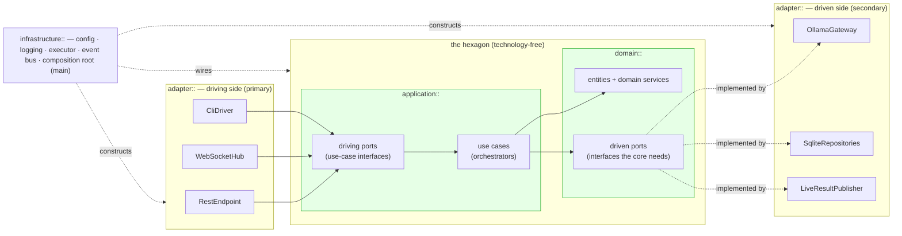
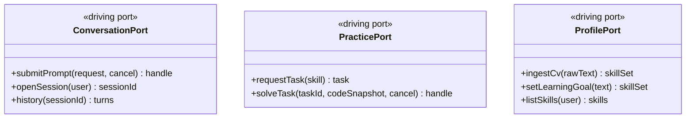
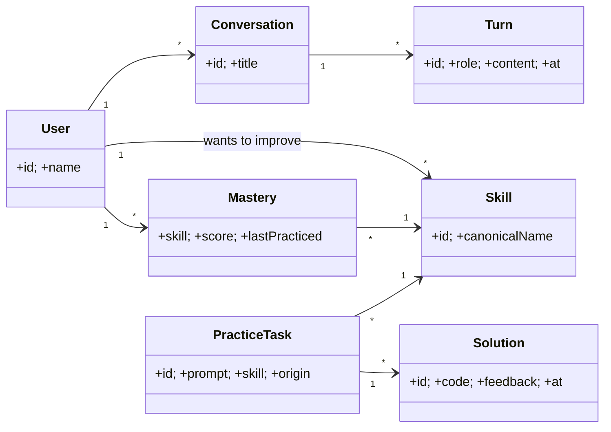
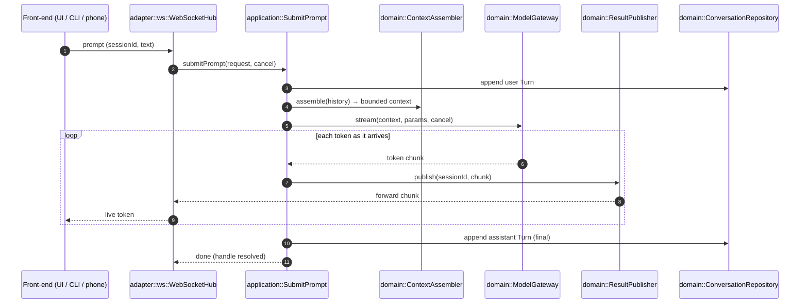
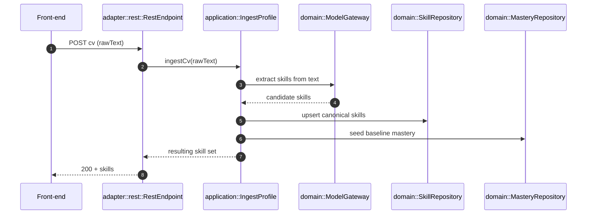
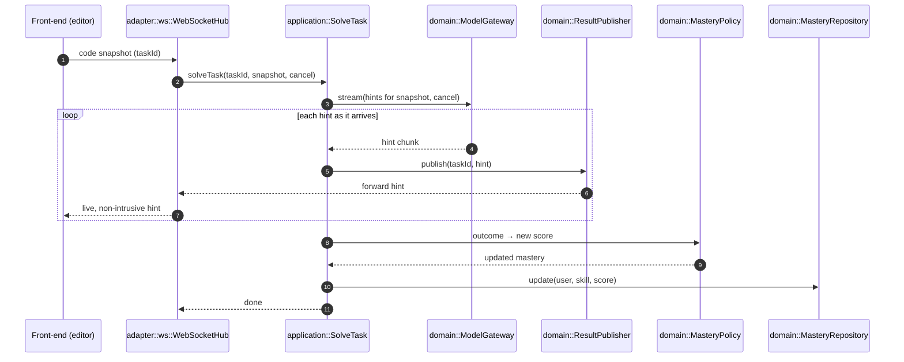
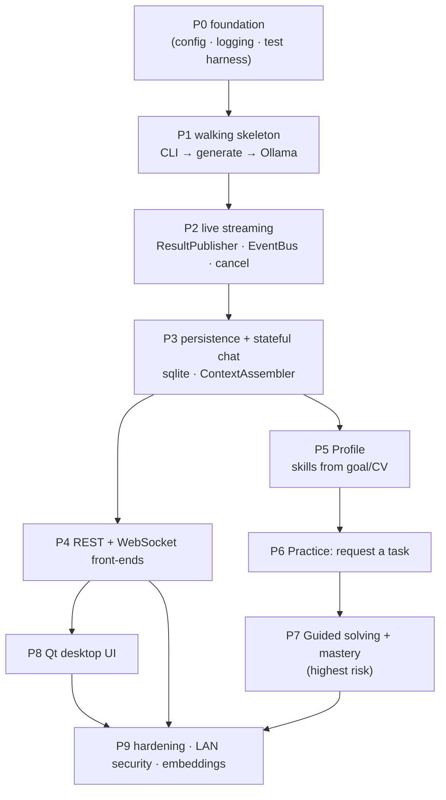

# aisim — Architecture (Hexagonal)

> **Status:** design. No code prescriptions here — this document fixes the
> *shape* of the system: its boundaries, the **ports** that cross them, the
> high-level **entities**, and the **message flows**. It deliberately says
> nothing about libraries, STL types, or build files. Those are downstream
> choices that must not leak into the architecture.
>
> This document takes a **lean** view of the product domain — enough to be
> faithful to the skill-gap practice loop, not so much that the architecture
> drowns in product detail.

---

## 1. What aisim is

aisim is a **single-user desktop application** that helps a developer **practice
and improve their coding skills**. The user points it at *what they want to get
better at* — either inferred from their **CV** or stated as a **learning goal** —
and aisim drives a practice loop: it generates coding tasks, watches the user
solve them, and gives live, non-intrusive feedback while tracking how mastery
grows.

Three facts dictate the architecture:

1. **The brain is a local LLM.** aisim talks to a locally-running **Ollama**
   server using the **qwen** coder model today — but the choice of engine and
   model must be **replaceable** without touching the core.
2. **Many front-ends, one core.** Requests arrive from a **desktop UI**, a
   **command line**, or a **phone**. They are either *prompts for the AI* or
   *UI actions* (e.g. "load my CV"). The core must not care which front-end
   spoke.
3. **Results stream back live.** Answers — especially model tokens and coaching
   hints — must reach the originating front-end **as soon as they are
   available**, not in one final lump.

The architecture that satisfies all three with the least machinery is the
**Hexagon (Ports & Adapters)**: a technology-free core surrounded by adapters,
all communication crossing through explicit ports.

---

## 2. Architectural style & namespaces

The codebase is organized into four namespace scopes that map directly onto the
hexagon. **The namespace tells you the dependency rules a piece of code must
obey** — that is the whole point of naming them.

| Namespace | Role in the hexagon | May depend on | Knows about technology? |
|---|---|---|---|
| `domain::` | The **inside** of the hexagon: entities, domain rules, and the **driven ports** (interfaces the core *needs*). | Nothing. Pure. | **No.** No HTTP, no SQL, no Ollama, no JSON. |
| `application::` | Use cases (orchestration) and the **driving ports** (interfaces the core *offers* to the world). | `domain::` only. | **No.** |
| `adapter::` | The **outside** of the hexagon: concrete adapters that *drive* the core (REST/WS/CLI) or are *driven by* it (Ollama, database, publisher). | `application::`, `domain::` ports. | **Yes.** This is where technology lives. |
| `infrastructure::` | Cross-cutting plumbing and the **composition root**: configuration, logging, the executor/threading, the in-process event bus, and `main()`. | Everything (it wires everything). | **Yes.** |

**The dependency rule (the load-bearing invariant):** arrows point *inward*.
`adapter::` and `infrastructure::` depend on `application::` and `domain::`;
`application::` depends on `domain::`; `domain::` depends on **nothing**. A
dependency that points outward — domain code that names an adapter — is an
architecture violation, full stop.



**How to read it:** the outside world enters from the **left** (primary/driving
adapters), is translated into calls on **driving ports**, handled by **use
cases**, which manipulate **entities** and reach back out through **driven
ports** to the **right** (secondary/driven adapters). `infrastructure::` stands
outside the flow and assembles the parts.

---

## 3. Ports catalog

A **port is an interface owned by the core**. There are two kinds, and the
distinction is *direction*:

- **Driving (primary) ports** — live in `application::`. They are the **API the
  core exposes**. Driving adapters *call* them.
- **Driven (secondary) ports** — live in `domain::`. They are the **capabilities
  the core requires**. Driven adapters *implement* them.

This is what makes the engine and the database swappable: the core names only
the port; `infrastructure::` decides which adapter satisfies it.

### 3.1 Driving ports (`application::`) — what the core offers



| Port | Purpose | Called by |
|---|---|---|
| `application::ConversationPort` | Ask the AI things and hold a stateful, multi-turn conversation about code. | REST, WS, CLI adapters |
| `application::PracticePort` | The practice loop: get a task for a skill, submit a solution and receive live hints. | REST, WS, CLI adapters |
| `application::ProfilePort` | Tell aisim *what to get better at* — ingest a CV or set a learning goal; list the resulting skills. | REST, CLI adapters |

> Streaming operations (`submitPrompt`, `solveTask`) return a lightweight
> **handle** and deliver their output **asynchronously** through the
> `ResultPublisher` driven port (§3.2) — the caller does not block waiting for
> the full answer. `cancel` is a cooperative cancellation signal.

### 3.2 Driven ports (`domain::`) — what the core needs

```mermaid
classDiagram
    class ModelGateway {
        <<driven port>>
        +generate(prompt, params, cancel) text
        +stream(prompt, params, cancel) tokenStream
        +capabilities() Capabilities
    }
    class EmbeddingGateway {
        <<driven port · optional>>
        +embed(text) vector
    }
    class ResultPublisher {
        <<driven port>>
        +publish(target, chunk) void
    }
    class ConversationRepository {
        <<driven port>>
        +save(turn) / load(sessionId)
    }
    class SkillRepository {
        <<driven port>>
        +upsert(skill) / forUser(user)
    }
    class TaskRepository {
        <<driven port>>
        +add(task) / byId(id) / bySkill(skill)
    }
    class MasteryRepository {
        <<driven port>>
        +get(user, skill) / update(user, skill, score)
    }
```



| Port | Purpose | Implemented by (today) |
|---|---|---|
| `domain::ModelGateway` | Engine-agnostic access to the LLM: one-shot generate, token streaming, and **capability discovery** (does this engine stream? embed? do JSON?). The *only* abstraction the core has for "the AI". | `adapter::ollama::OllamaGateway` |
| `domain::EmbeddingGateway` | **Optional** semantic-vector access for skill/task matching. Absent-capability degrades gracefully (string matching instead). | `adapter::ollama::OllamaGateway` (or a different model) |
| `domain::ResultPublisher` | The **outbound live channel**: pushes a result chunk toward whoever is listening for a given target (session/task). This is how "publish as soon as available" is expressed without the core knowing about WebSockets. | `adapter::ws::LiveResultPublisher` |
| `domain::ConversationRepository` | Persist and load conversations and their turns. | `adapter::sqlite::*` |
| `domain::SkillRepository` | Persist the user's skills (canonical names). | `adapter::sqlite::*` |
| `domain::TaskRepository` | Persist practice tasks and their solutions, indexed by skill. | `adapter::sqlite::*` |
| `domain::MasteryRepository` | Persist a per-skill mastery score; the practice loop reads and bumps it. | `adapter::sqlite::*` |

> **Why `ModelGateway` mentions `capabilities()`:** "engine-agnostic" cannot mean
> "every engine does everything." It means *the core asks what an engine can do
> and degrades gracefully*. Swapping qwen for another model, or Ollama for
> another server, is then a matter of providing a different adapter — no core
> change.

---

## 4. Domain entities (lean core)

The entities below are **plain values with identity and rules** — no I/O, no
persistence awareness. They are the vocabulary every use case speaks.



| Entity | Purpose | Cardinality | Lifecycle |
|---|---|---|---|
| `User` | The single person using aisim; anchors everything they own. | Exactly **1** per installation. | Created at first run (mandatory name); lives for the life of the install. |
| `Conversation` | A stateful, multi-turn dialogue with the AI about code. | **0..\*** per user. | Created when a chat opens; persists until deleted; reloaded across restarts. |
| `Turn` | One message in a conversation (user or assistant). | **1..\*** per conversation. | Appended as the chat proceeds; immutable once written. |
| `Skill` | A canonical thing-to-get-better-at (e.g. "C++ concurrency"). Normalizes free-text mentions so demand and mastery line up. | **0..\***, shared/deduplicated. | Created the first time a skill is seen (from CV, goal, or a task); long-lived. |
| `Mastery` | How well the user has mastered a skill — the signal that decides *what to practice next*. | **1** per (user, skill). | Created when a skill enters the user's set; **updated every time a task is solved**. |
| `PracticeTask` | A coding exercise targeting a skill. `origin` records whether it was user-supplied or AI-generated. | **0..\*** per skill. | Generated/added on demand; persisted; consumed by the solving flow. |
| `Solution` | An attempt at a task plus the feedback it drew. | **0..\*** per task. | Created when the user submits/solves; retained as history. |

**Domain services** (pure logic, still `domain::`, no I/O):

| Service | Purpose | Cardinality | Lifecycle |
|---|---|---|---|
| `domain::SkillAssessor` | Decide **which skill to practice next** from the user's skills and their mastery (lean stand-in for the old skill-gap math: prefer low-mastery skills). | Stateless singleton. | Lives for the process; injected where needed. |
| `domain::MasteryPolicy` | Compute the new mastery score from a solving outcome. Pure and deterministic — easy to test hard. | Stateless singleton. | Process-lifetime. |
| `domain::ContextAssembler` | Turn a conversation's history into a bounded prompt context (truncate/summarize when too long). | Stateless singleton. | Process-lifetime. |

> **Lean note.** CV and learning-goal *ingestion* exist (see `ProfilePort` and
> `IngestProfile`), but in this lean model they are **feeders that produce
> `Skill`s and seed `Mastery`** — not a full CV/JobDescription/SkillGap entity
> graph. If the richer skill-gap loop is wanted as first-class entities, that is
> a deliberate expansion — see **Open questions**.

---

## 5. Components (adapters & infrastructure)

Everything in §5 is *outside* the hexagon. Each names the port it sits against.

### 5.1 Driving adapters (`adapter::`) — they call into the core

| Component | Purpose | Duties | Cardinality | Lifecycle |
|---|---|---|---|---|
| `adapter::rest::RestEndpoint` | Expose the core over **HTTP/REST** for request/response and CRUD-style actions (load CV, set goal, list skills, fetch history, settings). | Parse requests → DTOs; call the right driving port; map results & `Error`s to HTTP responses; authenticate. | **1** server, many concurrent requests. | Constructed at startup by the composition root; runs until shutdown. |
| `adapter::ws::WebSocketHub` | Expose the core over a **WebSocket** for live, full-duplex exchanges — streamed prompts and live coaching. | Accept connections; translate inbound messages → driving-port calls; **fan streamed results out** to the right connection (it is the listener side of `ResultPublisher`). | **1** hub; **0..\*** live connections. | Hub lives for the process; each connection lives for its socket. |
| `adapter::cli::CliDriver` | Drive the core from the **command line** (and serve as a thin client / debug harness). | Read a command/prompt; call a driving port; render results (including streamed output) to the terminal. | **0..\*** invocations. | Per-invocation, or a long-lived interactive session. |

> All three driving adapters depend **only on driving ports**. None of them knows
> about Ollama, SQLite, or the entities' internals. Adding a fourth front-end is
> a new adapter and zero core change.

### 5.2 Driven adapters (`adapter::`) — the core calls them

| Component | Implements | Purpose | Cardinality | Lifecycle |
|---|---|---|---|---|
| `adapter::ollama::OllamaGateway` | `domain::ModelGateway` (+ optionally `EmbeddingGateway`) | Speak Ollama's protocol to the local **qwen** model; stream tokens back; report capabilities. Encapsulates *all* engine/model specifics. | **1** (pooled connections internally). | Process-lifetime; reconfigurable (swap model/host) without touching the core. |
| `adapter::sqlite::*Repository` | the repository driven ports (§3.2) | Persist conversations, skills, tasks, mastery in the local database. | **1** backing store implementing several narrow ports. | Opened at startup, closed on shutdown; serializes writes safely. |
| `adapter::ws::LiveResultPublisher` | `domain::ResultPublisher` | Bridge the core's outbound results to the `WebSocketHub` (typically via the in-process event bus) so chunks reach the originating connection **the moment they exist**. | **1**. | Process-lifetime. |

### 5.3 Use cases (`application::`) — orchestrators behind the driving ports

Each use case is a **small, single-purpose orchestrator**: it implements a
driving port, coordinates domain services and driven ports, and owns the
transaction boundary. They hold **no state** between calls.

| Use case | Implements | Orchestrates | Cardinality / Lifecycle |
|---|---|---|---|
| `application::SubmitPrompt` | `ConversationPort` | `ContextAssembler` → `ModelGateway.stream` → `ResultPublisher` (live) → `ConversationRepository` (persist turns). | Stateless singleton; process-lifetime. |
| `application::IngestProfile` | `ProfilePort` | `ModelGateway` (extract skills from CV/goal text) → `SkillRepository` → seed `MasteryRepository`. | Stateless singleton. |
| `application::RequestPractice` | `PracticePort` | `SkillAssessor` (which skill?) → `ModelGateway` (generate task) → `TaskRepository`. | Stateless singleton. |
| `application::SolveTask` | `PracticePort` | `ModelGateway.stream` (hints) → `ResultPublisher` (live) → `MasteryPolicy` → `MasteryRepository` + `Solution` persisted. | Stateless singleton. |

### 5.4 Infrastructure (`infrastructure::`)

| Component | Purpose | Cardinality | Lifecycle |
|---|---|---|---|
| `infrastructure::CompositionRoot` | **The top-level object `main` builds — the application itself (see §5.5).** The only place that names concrete types: reads config, constructs adapters, injects them into use cases (by port), mounts the driving adapters, owns startup/shutdown. | **1** (built by `main`). | Builds everything at startup; tears down in reverse on shutdown. |
| `infrastructure::Config` | Layered configuration (defaults → file → environment): engine host, model name, data location, bind/auth. | **1**. | Loaded at startup. |
| `infrastructure::Logger` | Structured logging available to every layer through a thin sink interface (so the core stays test-friendly). | **1**. | Process-lifetime. |
| `infrastructure::Executor` | A **bounded worker pool** that runs AI/IO work off the front-end threads, with cooperative cancellation — so a saturated model queue never freezes the UI. | **1**. | Started at boot, drained on shutdown. |
| `infrastructure::EventBus` | In-process, thread-safe hand-off that decouples producers (a use case emitting tokens) from consumers (the WS hub). The seam `LiveResultPublisher` rides on. | **1**. | Process-lifetime. |

### 5.5 The core object — what `main` instantiates

**`infrastructure::CompositionRoot` is the application object.** It is the one
thing `main()` constructs, and it owns every other object's lifetime. Think of
it as `AisimApplication`: build it, `run()` it, and on exit `shutdown()` it.

A natural question is *"where is the `AisimManager` that orchestrates
everything?"* — and the deliberate answer of this architecture is: **there
isn't one, on purpose.** A single god-orchestrator that knew about conversations
*and* practice *and* the model *and* the database would re-centralize exactly
the coupling the hexagon exists to break. Instead, orchestration is **split by
use case** (§5.3): `SubmitPrompt`, `IngestProfile`, `RequestPractice`,
`SolveTask` each orchestrate *one* flow. So the responsibility usually pinned on
a "manager" is divided in two:

- **Per-request orchestration → the use cases.** Each driving-port call is
  handled end-to-end by its own stateless use case. There is no shared
  conductor between them.
- **Process-level wiring & lifecycle → the `CompositionRoot`.** It decides
  *which concrete adapter satisfies each port*, hands those adapters to the use
  cases, mounts the use cases behind the driving adapters (REST/WS/CLI), and
  starts/stops the whole assembly. It holds **no business logic** — once
  everything is wired, requests flow through it without it being on the call
  path.

This keeps the "core class" honest: it is a **builder and owner**, not a brain.
The brains are the use cases and domain services, and they never know who built
them.

**What `main` does (the only sequence the core object dictates):**

```mermaid
sequenceDiagram
    autonumber
    participant M as main()
    participant CR as infrastructure::CompositionRoot
    participant DRIVEN as driven adapters<br/>(Ollama, Sqlite, Publisher)
    participant UC as use cases<br/>(application::)
    participant DRIVING as driving adapters<br/>(REST / WS / CLI)

    M->>CR: construct(Config)
    Note over CR: build inward-out (see §7)
    CR->>DRIVEN: construct storage, engine, bus, publisher
    CR->>UC: construct use cases, injecting driven ports
    CR->>DRIVING: construct REST/WS/CLI, injecting driving ports
    M->>CR: run()
    Note over CR,DRIVING: servers accept connections;<br/>requests flow port→use case→port
    M->>CR: shutdown() (on signal)
    Note over CR,DRIVEN: stop accepting → drain streams →<br/>flush writes → close store (reverse order)
```

In other words: **`main` builds one `CompositionRoot`, calls `run()`, and waits
for `shutdown()`.** Everything else — which model, which database, which
front-ends — is a decision made *inside* that object and nowhere else. A
from-scratch `main.cpp` is therefore tiny: read config, construct the
`CompositionRoot`, run it, handle the shutdown signal.

> **Why "composition root"?** It is the dependency-injection term (Seemann) for
> *the single place where an application's object graph is composed* — where
> concrete implementations are chosen and plugged into the ports that need them.
> "Compose as close to the entry point as possible, and only once": that *once*
> is this object. The name makes the "only place that names concrete types" rule
> a named, enforceable rule rather than a convention. `AisimApplication` is a
> fair intuition for *what* it is; `CompositionRoot` says *why* it exists.

---

### 5.6 Source layout — the hexagon on disk

The directory tree under `src/` **mirrors the four namespace scopes one-to-one**,
so a path tells you the layer, and the layer tells you the dependency rules
(§2). This is deliberate: the dependency rule is the load-bearing invariant, and
a flat folder of files would hide it exactly where developers navigate. The
granularity stops at **layer** (and, inside `adapter::`, at *technology*) — there
is no directory per entity or per port, which would multiply folders without
adding meaning.

```
src/
├── domain/            # domain::       pure core — depends on NOTHING
│   ├── domain.cppm        entities + services + driven ports (as partitions)
│   └── ports/             driven ports: ModelGateway, ResultPublisher, repos
│
├── application/       # application::  use cases + driving ports — domain:: only
│   ├── ports/             driving ports: ConversationPort, PracticePort, …
│   └── use_cases/         SubmitPrompt, IngestProfile, RequestPractice, SolveTask
│
├── adapter/           # adapter::      technology lives here — application:: + domain::
│   ├── ollama/            OllamaGateway          (implements ModelGateway)
│   ├── sqlite/            *Repository            (implement repository ports)
│   ├── ws/                WebSocketHub, LiveResultPublisher
│   ├── rest/              RestEndpoint
│   └── cli/               CliDriver
│
├── infrastructure/    # infrastructure::  composition root + main()
│   ├── composition_root.cppm   the one place that names concrete types
│   └── main.cpp                tiny: construct → run() → shutdown()
│
└── ui/
    └── qt/            # a DRIVING adapter, hoisted for practicality (see below)
```

| Directory | Hexagon layer | May depend on | Example contents |
|---|---|---|---|
| `src/domain/` | `domain::` — inside | **nothing** | `User`, `Mastery`, `SkillAssessor`; the driven ports `ModelGateway`, `ResultPublisher`, `*Repository` |
| `src/application/` | `application::` | `domain::` only | driving ports `ConversationPort`/`PracticePort`/`ProfilePort`; use cases `SubmitPrompt`, `SolveTask` |
| `src/adapter/` | `adapter::` — outside | `application::`, `domain::` | `ollama::OllamaGateway`, `sqlite::*Repository`, `ws::WebSocketHub`, `rest::RestEndpoint`, `cli::CliDriver` |
| `src/infrastructure/` | `infrastructure::` | everything (it wires) | `CompositionRoot`, `Config`, `Logger`, `Executor`, `EventBus`, `main` |
| `src/ui/qt/` | `adapter::` (driving) | driving ports only | the Qt desktop front-end |

**Two placement decisions worth stating:**

- **Ports live with the layer that *owns* them, not in one global `ports/`.**
  Driven ports are under `domain/`, driving ports under `application/`. A single
  top-level `ports/` directory would mix two different layers and break the
  "path ⇒ dependency layer" property. The split keeps the question *"can this
  code see that port?"* answerable from the path alone.
- **`ui/qt` is a driving adapter, hoisted to `src/ui/`.** In strict terms a GUI
  is just another driving adapter, like `rest` or `cli`, and could sit at
  `src/adapter/ui/qt/`. It is hoisted to top level only for practicality — a GUI
  brings its own dependencies (Qt), resources, and codegen (MOC) and reads more
  clearly unburied. Its architectural role (depends on driving ports only) is
  unchanged.

#### The structure is *enforced*, not merely suggested

Each layer is its own **C++ module library** with an explicit link interface, so
the dependency rule is checked by the build, not by discipline:

| Module library | Links (`PUBLIC`) | Module |
|---|---|---|
| `aisim_domain` | *(nothing)* | `aisim.domain` |
| `aisim_application` | `aisim_domain` | `aisim.application` |
| `aisim_adapter` | `aisim_application`, `aisim_domain` | `aisim.adapter` |
| `aisim_infrastructure` | all of the above | `aisim.infrastructure` |

Because `aisim_domain` links nothing, a domain file that does `import
aisim.adapter;` **fails to build** (`module 'aisim.adapter' not found`) — the
outward-pointing dependency §8 calls "an architecture violation, full stop"
becomes a compile/link error instead of silent rot. Technology dependencies
(libcurl, SQLite, a WebSocket library) are linked **`PRIVATE`** inside
`adapter/`, so they cannot leak past that layer either.

> A standalone, worked driven-adapter reference — an Ollama client built with
> the same module style and a Catch2 suite — lives in
> `examples/ollama-client/`. It is intentionally *not* part of this build; it
> shows the `Backend`-concept seam (a stand-in for `ModelGateway`) in isolation.

---

## 6. Message flows

### 6.1 Streamed prompt (UI/CLI/phone → AI → live back)

The canonical flow: a prompt arrives over WebSocket, the answer streams back
token-by-token **as it is produced**.



**Note the seam:** the use case never touches a socket. It publishes to
`ResultPublisher`; whether that ends up on a WebSocket, a terminal, or a future
transport is the adapter's concern.

### 6.2 UI action — "load my CV" (request/response over REST)



### 6.3 Guided solving (live coaching + mastery update)



---

## 7. Concurrency & lifecycle (high level)

The architecture only commits to the **boundaries** of concurrency — not the
mechanism:

- **Front-end I/O is separate from AI work.** Driving adapters accept requests on
  their own threads; long-running AI/IO work is handed to the
  `infrastructure::Executor`. A slow model never blocks a cheap call (settings,
  history).
- **Results flow one way, through the bus.** Producers (use cases) publish; the
  WebSocket hub consumes. No shared mutable state crosses that line beyond the
  hand-off — `EventBus` + `ResultPublisher` are the only contact points.
- **Everything is cancellable.** A `cancel` signal threads from the driving port
  through the use case into `ModelGateway`, so an abandoned prompt or a closed
  editor stops the in-flight request instead of leaking it.
- **Deterministic startup/shutdown.** `CompositionRoot` builds outermost-last
  (storage → engine → bus → use cases → servers) and tears down in reverse:
  stop accepting → drain live streams → flush writes → close the store.

---

## 8. Why this shape (and what it buys)

- **Swap the engine or model freely.** Only `OllamaGateway` knows about Ollama or
  qwen. A new engine = a new `ModelGateway` adapter; the core is untouched. The
  `capabilities()` query lets features degrade gracefully when an engine lacks
  one.
- **Add a front-end freely.** UI, CLI, and phone are interchangeable driving
  adapters over the same driving ports. A new client adds an adapter, nothing
  more.
- **Test the brain without the world.** `domain::` and `application::` depend on
  no technology, so use cases and domain services test against fake ports — no
  Ollama, no database, no sockets.
- **The namespaces enforce it.** Because `domain::`/`application::` cannot name
  `adapter::` types, the dependency rule is structural, not a guideline. A
  violation fails to compile rather than rotting silently.

---

## 9. Open questions (please confirm)

These genuinely change the model and were left out rather than assumed:

1. **Domain depth.** This doc uses a **lean** domain (Skill, Mastery,
   PracticeTask, Conversation). The older docs model a full **skill-gap loop**
   (CV → JobDescription → demand weighting → SkillGap → PracticePlan). Should the
   richer entities be promoted to first-class here, or is the lean core the
   intended scope?
2. **CV vs. learning goal.** Are *both* inputs in scope from the start, or is one
   (e.g. a stated learning goal) the initial driver with CV ingestion later?
3. **Phone reach.** Is the phone assumed to be on the **same LAN** as the
   desktop? "From anywhere" implies a materially larger design (relay + real
   auth + transport security) and would add a section.
4. **What "live feedback" watches.** §6.3 assumes the editor sends **debounced
   code snapshots** (on pause/save), not every keystroke. Confirm that, since it
   shapes both the WS protocol and the front-end's responsibilities.
5. **Multiple conversations/tasks at once.** Is concurrent activity (several live
   streams in flight) a requirement, or is one-at-a-time acceptable for v1? It
   affects how hard the executor and publisher must work.

---

## 10. Implementation roadmap (single developer)

> **Status:** proposed. This section turns the *shape* above into an *order of
> work*. Guiding rule, from the hexagon's own logic: build a **walking skeleton**
> — the thinnest slice that runs end-to-end through a real port — then **thicken
> one vertical slice at a time**. Every phase is demoable and testable at its
> end; integration is never deferred. Each phase is sized for one developer
> (roughly a few days).
>
> The payoff of the architecture shows up at every step: each new **port** gets a
> **fake**, so the core stays testable without Ollama, SQLite, or sockets, and
> each **adapter** is purely additive — no core change.

### 10.0 Decisions this roadmap assumes (see §9)

The open questions in §9 change the model, so the roadmap commits to **lean
defaults** to avoid forking. Flip any of these deliberately — #1 and #3 in
particular expand scope materially.

| §9 | Question | Assumed default for v1 |
|---|---|---|
| 1 | Domain depth | **Lean** core (Skill, Mastery, PracticeTask, Conversation). No CV→JD→demand→SkillGap entity graph. |
| 2 | CV vs. learning goal | **Learning goal first**; CV ingestion later, through the same `ProfilePort`. |
| 3 | Phone reach | **Same LAN only**. No relay / public auth / TLS section. |
| 4 | Live-feedback granularity | **Debounced code snapshots** (on pause/save), not per-keystroke. |
| 5 | Concurrency | **One live stream at a time** is acceptable; ports allow more, but v1 doesn't build for it. |

### 10.1 Where the code already is

The four module libraries and the inward-only link rules from §5.6 **already
exist** as a scaffold (placeholder `layer_name()` per layer, a tiny `main.cpp`, a
`CompositionRoot` shell). The worked Ollama client in `examples/ollama-client/`
is the reference to port `OllamaGateway` from. So "set up the structure" is done;
the roadmap below fills it with behaviour.

### 10.2 Phases

**Critical path to a usable product:** P0 → P1 → P2 → P3 → P4 → P8 yields a
streaming chat GUI. P5 → P6 → P7 then layer in the actual *practice* purpose.



#### P0 — Finish the foundation (`infrastructure::`, `domain::` kernel)
*The structure exists; make it testable and give it a shared kernel.*

- Wire **Catch2 + ctest** across all four module libraries; one build/link smoke
  test per layer.
- A **clang debug preset** with ASan/UBSan in a local script.
- Pure shared kernel in `domain::`: a `Result<T>` / `Error` type and strong-typed
  IDs (`UserId`, `SessionId`, …).
- `infrastructure::Logger` — thin sink interface (+ null/console sink).
- `infrastructure::Config` — defaults → file (XDG `~/.config/aisim/`) → env
  (keep `OLLAMA_HOST`).
- 🎯 **DoD:** `ctest` green across targets, ASan clean, config loads.

#### P1 — Walking skeleton: one prompt round-trips (non-streaming)
*Thinnest end-to-end slice. CLI is the cheapest driving adapter, so it goes first.*

- `domain::ModelGateway` driven port — **`generate()` + `capabilities()` only**.
- `application::ConversationPort` (driving) with single-shot `submitPrompt`;
  `application::SubmitPrompt` use case over `ModelGateway`.
- `adapter::ollama::OllamaGateway` implementing `ModelGateway` — **ported from
  `examples/ollama-client/`**; libcurl linked `PRIVATE`.
- `FakeModelGateway` (deterministic, no network) for unit tests.
- `adapter::cli::CliDriver` calling the driving port; `CompositionRoot` wires it.
- 🧪 unit (`SubmitPrompt` + fake), Ollama error-body→`Error` mapping; E2E (CLI →
  real local model → non-empty answer).
- 🎯 **MILESTONE:** ask on the CLI, get a model answer; engine swappable behind
  the port.

#### P2 — Live streaming (`ResultPublisher` · `EventBus` · cancellation)
*The canonical flow of §6.1: tokens stream as produced.*

- Add `stream(prompt, params, cancel) → tokenStream` to `ModelGateway`;
  `OllamaGateway` sets `"stream":true`.
- `domain::ResultPublisher` driven port; `infrastructure::EventBus` (thread-safe
  hand-off) + `infrastructure::Executor` (bounded pool, AI work off the front-end
  thread).
- `SubmitPrompt` evolves: stream → `publish(sessionId, chunk)` per token.
- Cooperative **cancellation** threaded port → use case → gateway.
- A console `ResultPublisher` so the CLI renders the live stream.
- 🧪 cancel mid-stream leaks nothing (ASan/TSan); bus fan-out.
- 🎯 **DoD:** live token streaming on the CLI with working cancel, leak-clean.

#### P3 — Persistence + stateful chat (`adapter::sqlite` · `ContextAssembler`)
*Multi-turn conversation that survives restart (§6.1 persist steps).*

- Entities `User`, `Conversation`, `Turn`; `domain::ConversationRepository` port.
- `adapter::sqlite::*` repositories (SQLite linked `PRIVATE`, WAL, single writer).
- `domain::ContextAssembler` service: history → bounded prompt context.
- `SubmitPrompt`: append user turn → assemble context → stream → append assistant
  turn.
- `ConversationPort.openSession` / `history`; first-run captures a mandatory user
  name.
- 🧪 repo round-trip (in-memory DB), deterministic context truncation, multi-turn
  carries prior turns, restart survives history.
- 🎯 **DoD:** real multi-turn chat persisted across restarts.

#### P4 — REST + WebSocket front-ends (`adapter::rest` · `adapter::ws`)
*Add network front-ends over the same ports — zero core change.*

- `adapter::rest::RestEndpoint` for request/response (history, settings, later
  CV/skills).
- `adapter::ws::WebSocketHub` + `adapter::ws::LiveResultPublisher` (the real
  `ResultPublisher`, riding the `EventBus`) — fans chunks to the originating
  connection.
- 🧪 WS client gets incremental tokens; final persisted turn = concatenation;
  E2E `POST /generate`.
- 🎯 **MILESTONE:** usable streaming chat over REST/WS (UI still pending).

#### P5 — Profile: skills from a goal/CV (`ProfilePort` · `IngestProfile`)
*Tell aisim what to get better at (§6.2). Goal first, CV as a second feeder.*

- Entities `Skill`, `Mastery`; `SkillRepository` + `MasteryRepository` ports +
  sqlite impls.
- `application::ProfilePort` (`setLearningGoal` first, then `ingestCv`) +
  `IngestProfile`: `ModelGateway` extracts skills → upsert canonical skills →
  seed baseline mastery.
- REST/CLI routes; "skills detected" view data.
- 🧪 goal/CV text → normalized skills, mastery seeded.
- 🎯 **DoD:** free text → a canonical skill set with baseline mastery.

#### P6 — Practice loop: request a task (`PracticePort` · `RequestPractice`)

- Entity `PracticeTask` (with `origin`); `TaskRepository` port + sqlite impl.
- `domain::SkillAssessor` (pick the lowest-mastery skill).
- `application::RequestPractice` (`PracticePort.requestTask`): assessor →
  `ModelGateway` generates a task → persist.
- 🧪 assessor prefers low mastery; generated task persisted under its skill.
- 🎯 **DoD:** "give me something to practice" returns a stored, skill-tagged task.

#### P7 — Guided solving + mastery update (`SolveTask` · `MasteryPolicy`) — highest risk
*§6.3: live coaching + mastery bump. The trickiest "non-intrusive" tuning.*

- Entity `Solution`; `domain::MasteryPolicy` (pure score update).
- `application::SolveTask` (`PracticePort.solveTask`): stream hints via
  `ResultPublisher` → compute new score via `MasteryPolicy` → update
  `MasteryRepository` + persist `Solution`.
- WS protocol for **debounced snapshots** (decision §10.0 #4); hint
  rate-limit/dedupe.
- 🧪 wrong/wasteful solution → relevant hint; correct → fewer hints; mastery moves.
- 🎯 **MILESTONE — fully usable practice tool** (on manually-assessed skills).

#### P8 — Qt desktop UI (`src/ui/qt`, a driving adapter)

- Minimal Qt front-end over the driving ports only: name on first run, chat with
  streamed reply, history, pick-a-skill / solve-a-task with live hints.
- 🎯 **MILESTONE:** the loop end-to-end in a real GUI.

#### P9 — Hardening & reach (ongoing)

- Deterministic **shutdown** in `CompositionRoot` (stop accepting → drain streams
  → flush writes → close store, reverse order — §7).
- Bound the `Executor`; `/health` exposes core + engine + DB status.
- **LAN security** (decision §10.0 #3): shared token, `AuthGuard` on HTTP + WS
  handshake, localhost-by-default bind, optional phone client.
- **Optional `EmbeddingGateway`** + `capabilities()`-gated semantic skill
  matching (string-match fallback).
- Whole suite under TSan + ASan/UBSan in local CI.

> This roadmap deliberately follows the **lean** scope of §10.0 #1 — the
> JD/demand gap machinery is the largest thing to revisit if the full skill-gap
> loop is wanted.
