# aisim — Module Design & Modern C++ Playbook

> **Companion to** [`architecture.md`](./architecture.md) (the *shape*) and
> [`use-cases.md`](./use-cases.md) (the *product* — the skill-gap loop and its
> domain entities). This doc fixes the *substance*: per-module modern-C++
> features to try, the traps, class designs that stay decoupled and testable,
> the boundary entities + interfaces, and **alternatives weighed for
> maintainability** so you can decide.
>
> **Product context:** aisim is a coding-practice companion driven by the skill
> gap (`priority = demand × (1 − mastery)`). The domain — `TaxonomyService`,
> `StructuredExtractor`, `GapService`, and the practice/feeder use-cases — lives
> in `app` (§6); the transport architecture (§2–§5, §7) is unchanged by it.
>
> **How to read the trade-off tables:** every alternative is scored on
> *Maintainability*, *Decoupling*, *Testability*, *Complexity*, and *"Fun /
> modern-C++ value"* — Low / Med / High. The recommended option is marked ✅.

---

## 0. Design principles that apply everywhere

These are the load-bearing ideas. The per-module sections are applications of
them.

1. **Depend on ports, not implementations.** Every module exposes an *interface*
   (a `concept` or a pure-virtual "port"). The composition root (`aisimd`) is
   the only code that names concrete types. This is what lets a module be
   rewritten — or split into its own process later (Option B in the arch doc) —
   *without a cascade of edits*.

2. **`std::expected<T, Error>` for expected failures; exceptions only for bugs.**
   You already do this. Keep it as the universal result vocabulary. Reserve
   exceptions for programmer errors / unrecoverable invariants.

3. **Value semantics at the boundaries, references inside.** DTOs crossing
   module/API lines are plain value structs (cheap to copy, trivially testable,
   no hidden lifetime). Hot internal paths use references/spans/views.

4. **Concepts over inheritance when the set of implementations is known at
   compile time; virtual interfaces when it must be runtime-swappable or
   mocked across a binary boundary.** (We weigh this explicitly per module — it
   is *the* recurring class-design fork in this project.)

5. **Rule of zero.** No hand-written destructors/copy/move unless a class owns a
   raw resource. RAII wrappers own resources; everything else is rule-of-zero
   and therefore safe to move/test.

6. **Make illegal states unrepresentable.** `enum class` + `std::variant` +
   strong typedefs (`SessionId`, `Token`) instead of bare `int`/`std::string`.

### Recurring class-design fork: `concept` vs. virtual `Port`

This decision shows up in *every* module, so decide the rule once:

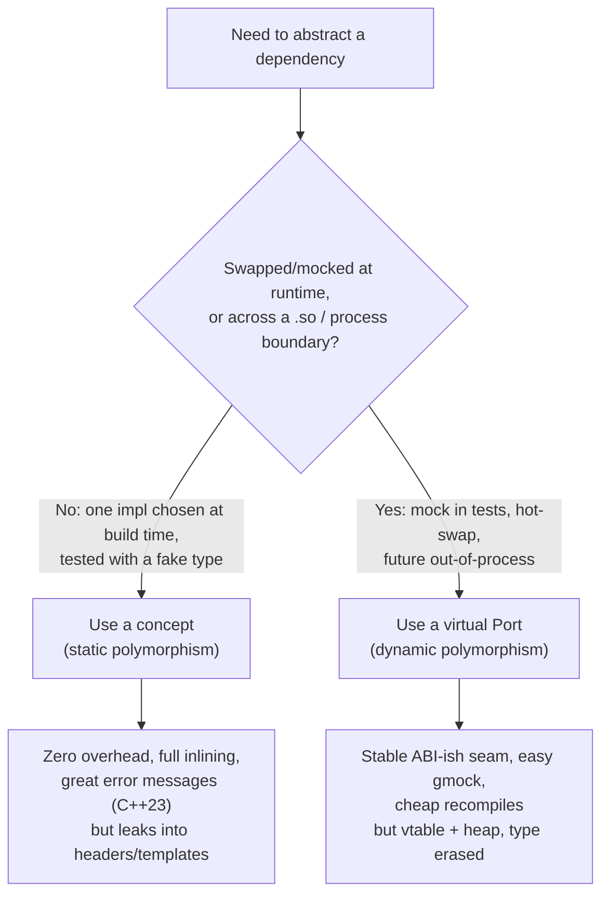

| Approach | Maintainability | Decoupling | Testability | Complexity | Fun/modern |
|---|---|---|---|---|---|
| **`concept` (static)** | Med (templates ripple through headers) | High | Med (fakes are *types*, not injected objs) | Low | **High** |
| **Virtual `Port` (dynamic)** ✅ *at module seams* | **High** | **High** | **High** (trivial mocks) | Low | Med |
| **Hybrid: virtual seam + `concept`-constrained impls** ✅ *recommended* | High | High | High | Med | High |

**Recommendation:** use **virtual ports at the seams between modules**
(`AiPort`, `StoragePort`, `EventSink`) — they recompile fast, mock trivially,
and are the natural fracture line if a module later moves out-of-process. Use
**concepts *inside* a module** to constrain the concrete strategies (e.g. your
existing `Backend` concept constrains the HTTP transports inside `ai`). Best of
both: a stable polymorphic boundary, zero-overhead static dispatch within.

---

## 1. System boundaries & the entities that cross them

Before per-module detail, here are the **transport/runtime boundary entities**
(DTOs) — the vocabulary that flows between layers. Kept deliberately shallow; the
point is the *interfaces*, not the field lists.

> **Two entity layers, don't conflate them.** The DTOs below are the
> *infrastructure* vocabulary (a prompt, a token, a setting, a search hit). The
> **product domain entities** — `Skill`, `SkillGap`, `Mastery`, `CV`,
> `JobDescription`, `SkillDemand`, `Task`, `PracticePlan` — and the skill-gap
> loop they form live in [`use-cases.md`](./use-cases.md) §4 and are owned by
> `app` (§6). Domain entities are built *from* these DTOs at the edge and persist
> through the storage interfaces; they never leak transport types.

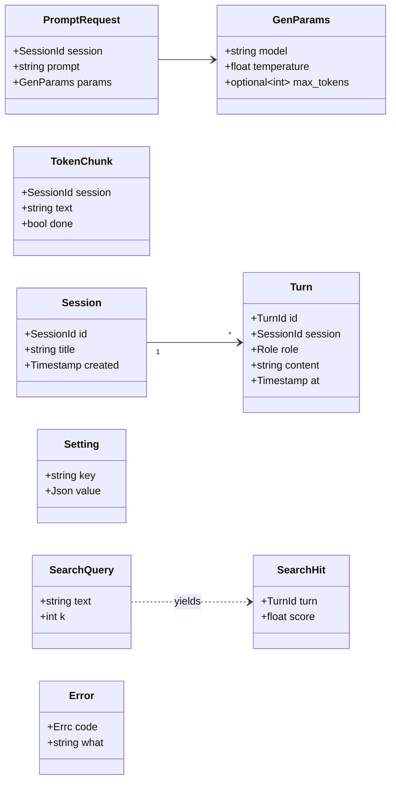

**Who owns/produces what:**

| Entity | Produced by | Consumed by | Crosses |
|---|---|---|---|
| `PromptRequest` | API edge (from HTTP/WS) | `app` → `ai` | UI→Core |
| `TokenChunk` | `ai` (stream) | `events`→`api`→WS | Core→UI |
| `Turn` / `Session` | `app` | `storage`, API edge | both ways |
| `Setting` | API edge / `app` | `storage` | both ways |
| `SearchQuery`/`SearchHit` | API edge / `app` | `storage` (vec) | both ways |
| `Error` | any module | up the stack | everywhere |

These are **plain value types** in `common` (rule of zero), serializable to JSON
at the edge. No module passes its *internal* types across a port.

---

## 2. `common` — shared vocabulary & primitives

The foundation everything links. Keep it tiny and dependency-free.

**Modern C++ to try**
- **`std::expected<T, Error>`** as the universal `Result<T>` alias (you already
  use it).
- **Strong typedefs** via a tiny `Tagged<T, struct Tag>` template →
  `SessionId`, `TurnId`, `Token`. Prevents "passed the wrong string" bugs.
- **`enum class Errc` + a custom `error_category`** so errors compose with
  `std::error_code` semantics while staying in `expected`.
- **`std::source_location`** baked into the logger for zero-boilerplate call
  sites.
- **`constexpr`/`consteval`** config keys and compile-time validation of enums.
- **C++23 `std::print`/`std::println`** (already in use) for logging sinks.

**Challenges / attention**
- Resist the urge to dump everything here. `common` must not depend on any other
  module or heavy third-party lib, or it becomes a recompile bottleneck.
- Strong-typedef ergonomics: provide the *minimum* operators; don't accidentally
  make `SessionId` arithmetic.

**Class design for decoupling/testability**
- `Result<T>` and DTOs are values — nothing to mock.
- `ILogger` as a thin virtual sink (so tests capture logs); a `NullLogger` and a
  `ConsoleLogger` impl.

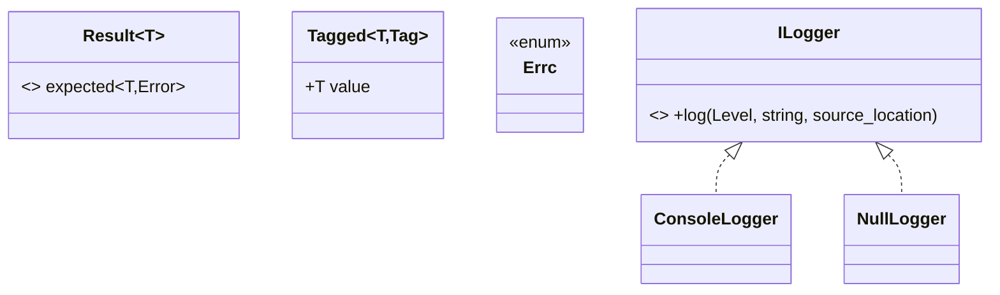

**Alternative weighed**

| Choice | Maintainability | Notes |
|---|---|---|
| Strong typedefs everywhere ✅ | High | Catches ID mix-ups at compile time; small upfront cost. |
| Bare `std::string`/`int` ids | Low | Zero cost now, silent bugs later. Not worth it. |

---

## 3. `ai` — Ollama orchestration

The evolution of today's `main.cpp`. Owns generation, streaming, cancellation,
embeddings.

**Boundary interface (`AiPort`)** — what the rest of the Core sees:

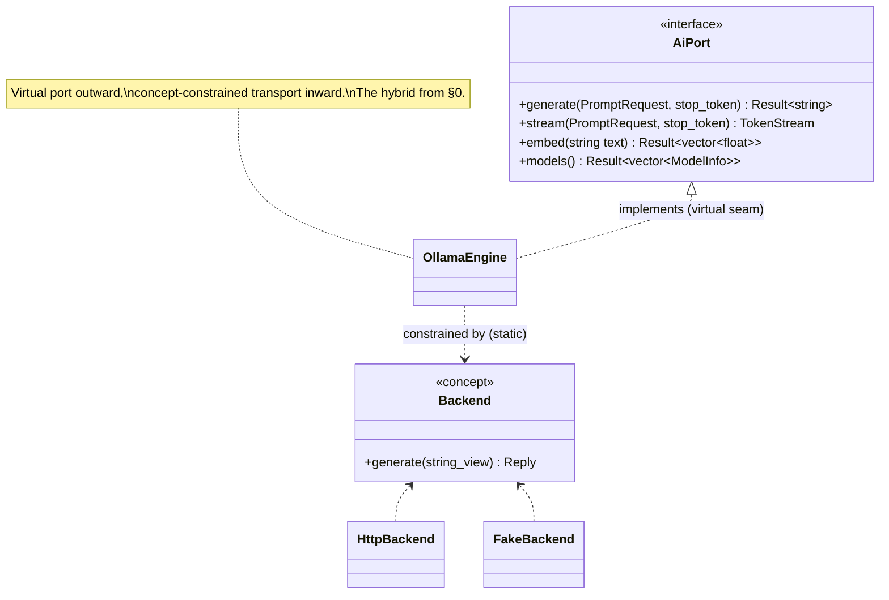

So: `AiPort` is the **virtual seam** (mockable, future out-of-process). Inside,
`OllamaEngine` is a template over your existing **`Backend` concept**, so the
HTTP transport is statically dispatched and a `FakeBackend` makes unit tests
deterministic with no network.

**Modern C++ to try**
- **Coroutines for streaming.** `TokenStream` = **`std::generator<TokenChunk>`**
  (C++23) — the AI module `co_yield`s tokens as Ollama streams them. Clean,
  lazy, composable with ranges. *This is the marquee "fun" feature here.*
  - If the executor is async (senders), an **async generator / `task<T>`** over
    the chosen coroutine support lib; `std::generator` is sync-pull, so pick
    based on whether the consumer pulls or you push (see challenge below).
- **`std::jthread` + `std::stop_token`** for cancellation — a closed chat stops
  the in-flight request cooperatively (you already use `jthread`).
- **Bounded executor / thread pool** (see §7 concurrency). Submit returns a
  `std::future` or a sender.
- **Ranges** to post-process token streams (filter, transform, take_while).
- **`std::expected`** end to end.
- Optional, cutting-edge: **`std::execution` (senders/receivers, P2300)** if the
  toolchain is ready — model "generate → parse → store" as a typed async
  pipeline. High fun, high risk (immature impls).

**Challenges / attention**
- **Sync `std::generator` vs. async I/O mismatch.** `std::generator` is
  pull-based and synchronous; network tokens arrive asynchronously. Two clean
  resolutions: (a) run the generation on a pool thread that *blocks* on curl and
  yields as chunks arrive — simple, one thread per active stream; or (b) go fully
  async with senders and an async-generator type — scalable, much harder. For a
  single user with a handful of concurrent chats, **(a) is the right call**.
- **Cancellation must reach libcurl.** A `stop_token` callback has to actually
  abort the transfer (curl multi + `CURLOPT_*` progress callback returning
  non-zero, or close the easy handle). Don't just drop the future — that leaks
  the request.
- **Backpressure.** If a client reads tokens slower than Ollama emits them,
  bound the buffer. A coroutine generator naturally applies backpressure when
  pull-based.
- **Don't leak the JSON/curl detail upward.** Today's `extract_response` string
  scraping is fine for a demo; behind `AiPort` it should become a real JSON
  parse, but the *port signature never mentions JSON or curl*.

**Class design / decoupling**
- `OllamaEngine` holds a `Backend` (concept-constrained) + an `Executor&` + an
  `EventSink&` (to publish `TokenChunk`s). All injected. No singletons.
- Mock by substituting `FakeBackend` (compile-time) *or* by implementing
  `AiPort` directly with a stub (runtime) for `app`-level tests.

**Alternatives weighed**

| Streaming mechanism | Maintainability | Testability | Complexity | Fun/modern |
|---|---|---|---|---|
| **`std::generator` + blocking pool thread** ✅ | High | High | Low | High |
| Callback/observer (`on_token(fn)`) | Med | Med | Low | Low |
| Full senders/receivers async generator | Med | Med | **High** | **High** (bleeding edge) |
| Manual `std::future` + polling | Low | Med | Med | Low |

| AI abstraction | Maintainability | Decoupling | Notes |
|---|---|---|---|
| **Virtual `AiPort` + inner `Backend` concept** ✅ | High | High | The hybrid; recommended. |
| Pure concept (`Backend` only, no port) | Med | Med | Templates leak into `app`; harder runtime mock. Fine for demo, weak for a service. |
| Pure virtual everywhere | High | High | Loses zero-overhead transport dispatch; minor. |

---

## 4. `storage` — SQLite + sqlite-vec

One engine, several **narrow stores**. Beyond settings + conversation history,
this holds the **product domain**: the skill/CV/JD/task/mastery data of the
skill-gap loop. Splitting by concern (Interface Segregation) lets each store be
mocked alone and lets vector search land later or degrade gracefully.

**Boundary interfaces** — each consumer depends only on the store it needs:

```mermaid
classDiagram
    class SettingsStore {
        <<interface>>
        +get(string key) Result~Json~
        +set(string key, Json) Result~void~
    }
    class SessionStore {
        <<interface>>
        +create(Session) Result~SessionId~
        +append(Turn) Result~TurnId~
        +history(SessionId) Result~vector~Turn~~
    }
    class SkillStore {
        <<interface>>
        +upsertCanonical(Skill) Result~SkillId~
        +bySkill(SkillId) Result~vector~Task~~
    }
    class CvStore { <<interface>> +save(CV) +skillsHeld(User) }
    class JobStore { <<interface>> +save(JobDescription) +demand(User) }
    class TaskStore { <<interface>> +add(Task) +byProvenance(...) }
    class MasteryStore { <<interface>> +get(User,SkillId) +update(...) }
    class VectorStore {
        <<interface>>
        +upsert(EntityId, vector~float~) Result~void~
        +search(vector~float~, int k) Result~vector~SearchHit~~
    }
    class SqliteStorage
    class UnitOfWork { <<interface>> +commit() +rollback() }
    SettingsStore <|.. SqliteStorage
    SessionStore  <|.. SqliteStorage
    SkillStore    <|.. SqliteStorage
    CvStore       <|.. SqliteStorage
    JobStore      <|.. SqliteStorage
    TaskStore     <|.. SqliteStorage
    MasteryStore  <|.. SqliteStorage
    VectorStore   <|.. SqliteStorage
    SqliteStorage ..> UnitOfWork : transactions
    note for SqliteStorage "One impl, many narrow interfaces.\nVector search = just VectorStore;\ndefer/degrade without breaking others.\nDomain stores back the skill-gap loop."
```

> **Atomicity that matters here:** appending a `Task` solution + bumping
> `MasteryStore`, or saving a `JobDescription` + its extracted `SkillDemand`
> rows, must be **one transaction** (Unit-of-Work) — a half-written gap corrupts
> prioritization.

**Modern C++ to try**
- **RAII connection & statement wrappers** (rule of zero on top of
  `unique_ptr` with custom deleters for `sqlite3*`/`sqlite3_stmt*`). Showcases
  ownership without leaks.
- **`std::span` / `std::string_view`** for bind parameters → no copies into the
  DB layer.
- **Templates + concepts for row mapping:** a `Row<T>` concept + a small
  `query<T>(sql, args...)` that maps columns to a struct via **aggregate
  reflection** (C++26 reflection if available; otherwise a tiny
  `tie`-based mapper). Fun and removes a *lot* of boilerplate.
- **`std::generator<Row>`** for streaming large result sets lazily (history
  export) instead of materializing huge vectors.
- **`std::flat_map`** (C++23) for in-memory settings cache.

**Challenges / attention**
- **Threading is the #1 trap.** SQLite + multithreading needs care:
  - Use **WAL mode** (concurrent readers, one writer).
  - **Serialize writes through a single writer thread** (a queue) to dodge
    `SQLITE_BUSY`. Reads can use a small connection pool.
  - Never share one `sqlite3*` across threads without `SQLITE_OPEN_FULLMUTEX`;
    prefer connection-per-thread.
- **`sqlite-vec` is the complexity hot-spot.** Loading the extension, dimension
  must match the embedding model, index maintenance, and keeping vectors in sync
  with the entities they describe (skills, tasks). Keep it strictly behind
  `VectorStore` so the rest of the app is oblivious — and so an engine without
  embeddings degrades to string/alias matching, not a crash.
- **Migrations.** Even single-user, schema *will* change (and the domain schema —
  skills/jobs/tasks/mastery — will churn early). A tiny versioned migration
  runner (`PRAGMA user_version`) from day one beats ad-hoc `ALTER`s.
- **Embeddings dependency.** `VectorStore.upsert` needs vectors from
  `EmbeddingPort.embed` — wire that in `app`, not in `storage` (storage must not
  know about the AI engine).

**Class design / decoupling**
- One `SqliteStorage` implements the many narrow interfaces but callers depend
  only on the one they need (`app`'s settings handler sees just `SettingsStore`;
  `GapService` sees `JobStore`+`CvStore`+`MasteryStore`). Interface Segregation =
  trivial mocks + clear intent.
- **Repository + Unit-of-Work** for transactional writes (solution + mastery
  bump, or job + its skill-demand rows, committed atomically).

**Alternatives weighed**

| Data-access style | Maintainability | Testability | Complexity | Fun/modern |
|---|---|---|---|---|
| **Narrow repositories (per concern) + UoW** ✅ | High | High | Med | Med |
| One fat `Database` god-object | Low | Low | Low | Low |
| Active Record (entities self-persist) | Med | Low | Med | Low |
| Compile-time query DSL (templates) | Med | High | **High** | **High** |

| Engine | Maintainability | Notes |
|---|---|---|
| **SQLite + sqlite-vec** ✅ | High | One file, embedded; relational domain data + vectors together. |
| SQLite (no vec) + separate vector lib | Med | Two stores to sync; only if sqlite-vec disappoints. |
| Embedded KV (LMDB) + manual vectors | Low | More plumbing, loses SQL queryability (the gap math wants joins). |

---

## 5. `events` — in-process pub/sub bus

Decouples the AI token producer from the WebSocket fan-out consumer. **Not** a
broker — a typed, thread-safe hand-off.

**Boundary interface**

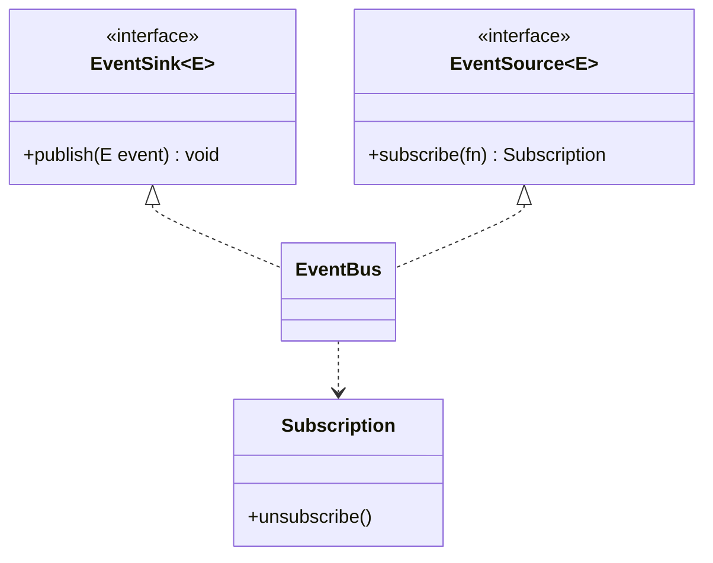

**Modern C++ to try**
- **Variant-typed events:** `using Event = std::variant<TokenChunk,
  GenProgress, ModelStatus, ...>;` consumed with `std::visit` + an overload set
  (`overloaded` idiom). Exhaustive, type-safe fan-out.
- **Templated `EventBus<E>`** so each event family is its own strongly-typed bus
  (no `std::any`, no string topics).
- **Lock-free / bounded MPSC queue** (`std::atomic`, or a ring buffer) for the
  producer→consumer hop. Great place to use **`std::atomic_ref`** and
  acquire/release ordering deliberately.
- **`std::move_only_function`** (C++23) for subscriber callbacks — supports
  capturing move-only state, unlike `std::function`.
- **Coroutine bridge (optional):** expose a subscription as
  `std::generator`/async-stream so the WS handler `co_await`s events.

**Challenges / attention**
- **Lifetime of subscribers.** A subscription must auto-unsubscribe on destroy
  (RAII `Subscription` token) or you get use-after-free fan-out. This is the
  classic observer bug — solve it with the token, not raw pointers.
- **Threading discipline.** Publishers run on AI pool threads; subscribers on
  the WS thread. Decide: does `publish` run subscriber callbacks inline (fast,
  but on the producer's thread) or hand off via queue (safe isolation,
  recommended)? Document it.
- **Backpressure / slow consumer.** If a WS client stalls, bound the per-
  subscriber queue and define a drop/disconnect policy. Don't let one slow phone
  balloon memory.
- **No re-entrancy surprises:** a subscriber that publishes must not deadlock.

**Class design / decoupling**
- Producers receive an `EventSink&`; consumers an `EventSource&`. Neither knows
  the other. The bus is injected by `aisimd`.

**Alternatives weighed**

| Bus design | Maintainability | Decoupling | Complexity | Fun/modern |
|---|---|---|---|---|
| **Templated typed bus + RAII subscription** ✅ | High | High | Med | High |
| `std::function` + string topics | Med | Med | Low | Low |
| Direct callbacks (no bus) | Med | **Low** (re-couples ai↔api) | Low | Low |
| Full async-stream (coroutine) bus | Med | High | High | **High** |

> **Evolve-without-refactor angle:** if you later split the AI module into its
> own process (arch Option B), the bus is the *only* thing that changes — swap
> the in-process queue for an IPC transport behind the same `EventSink`/
> `EventSource` interfaces. Nothing upstream/downstream moves.

---

## 6. `app` — domain / use-cases (the skill-gap loop lives here)

The "what aisim does" layer, and the home of the **product domain**. Pure
orchestration over ports; **no I/O, no curl, no SQL, no sockets**. This is the
most testable module and the one that must stay that way — because the
domain logic (gap math, prioritization, extraction orchestration) is exactly
what you want to unit-test hard.

It holds two kinds of code:
- **Domain services** — `TaxonomyService`, `StructuredExtractor<T>`,
  `GapService`. Reusable, port-backed, no transport awareness.
- **Use-cases** (command handlers) — practice engine (`GenerateTasks`,
  `SolveTask`), feeder (`IngestCv`, `IngestJob`, `ComputeDemand`), plus
  `SubmitPrompt`/`OpenSession`/`UpdateSettings`.

**Boundary interface — domain services + command handlers**

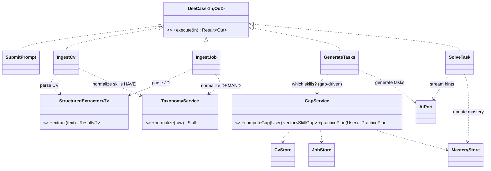

**The skill-gap loop** — how the feeder aims the engine (the product's core):

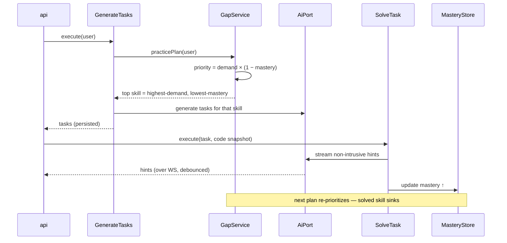

**The `SolveTask`/`SubmitPrompt` streaming flow** (ports compose for live feed):

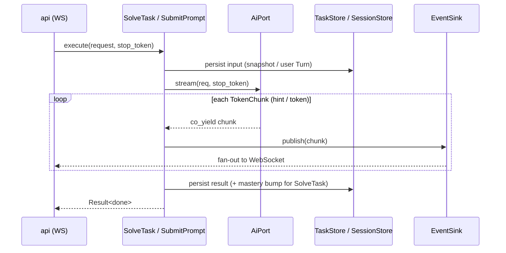

**Modern C++ to try**
- **Command pattern as small types** (one struct per use-case) — each is a
  `UseCase<In,Out>`. Easy to test in isolation, easy to add new ones (open/closed
  — *evolve without refactor*).
- **Coroutines for orchestration:** `task<Result<>> SubmitPrompt::execute(...)`
  if you adopt an async task type, so multi-step flows read sequentially while
  awaiting AI/DB.
- **`std::variant` command envelope** for the dispatcher (`std::visit` to route
  an incoming command to its handler) — exhaustive, no `if/else` ladder.
- **Concepts to constrain handlers** (`UseCase` concept) so registration is
  checked at compile time.

**Challenges / attention**
- **Keep it pure.** The temptation to "just call curl here" destroys
  testability. Enforce by *not linking* curl/sqlite into `app`'s target — it
  physically *can't* do I/O. (CMake-enforced architecture — a great trick.)
- **Transaction boundaries** belong here (solution + mastery bump, or job + its
  demand rows, atomically via UoW), not in `storage` and not in `api`.
- **Cancellation propagation:** the `stop_token` from the API edge must thread
  through the use-case into `AiPort` (a user abandoning a `SolveTask`).
- **Gap math is pure & deterministic — test it ruthlessly.** `GapService`
  (`priority = demand × (1 − mastery)`) takes data from stores and returns an
  ordering. With faked stores it needs *zero* AI/DB to test, yet it's the
  product's brain — cover ranking, ties, empty-CV, zero-JD edge cases.
- **Extraction is the non-deterministic seam.** `StructuredExtractor<T>` wraps a
  flaky LLM; keep its validate→repair logic here and behind an interface so a
  `StubExtractor` makes every dependent use-case test deterministic (⚠️4).
- **`skillSource` seam (⚠️12):** `GenerateTasks` picks skills from either a manual
  choice or `GapService`. Keep that a strategy behind one interface so flipping
  manual→gap-driven is config, not a rewrite.

**Class design / decoupling**
- Handlers + services take ports by reference (constructor-injected). No service
  locator, no globals. A handler's test = construct it with a few fakes, call
  `execute`, assert. `GapService` test = fake `CvStore`/`JobStore`/`MasteryStore`
  with canned rows, assert the ordering.

**Alternatives weighed**

| Use-case structure | Maintainability | Testability | Extensibility | Notes |
|---|---|---|---|---|
| **One type per use-case (Command)** ✅ | High | High | **High** | Add a feature = add a type; nothing else changes. |
| Fat `AppService` with many methods | Med | Med | Low | Grows into a god-class. |
| Free functions over ports | Med | High | Med | Fine but loses uniform dispatch/registration. |

| Where does gap/prioritization logic live? | Maintainability | Testability | Notes |
|---|---|---|---|
| **Pure `GapService` in `app`, port-backed** ✅ | High | **High** | Deterministic, no I/O; the brain stays unit-testable. |
| Computed in SQL inside `storage` | Med | Low | Fast but couples ranking to schema; hard to test/evolve the formula. |
| Computed at the `api` edge | Low | Low | Leaks domain into transport; re-implemented per client. |

---

## 7. `api` — HTTP + WebSocket edge

Translates the outside world ⇄ `app` commands. The *only* module that knows
JSON, HTTP, sockets, auth.

**Boundary**

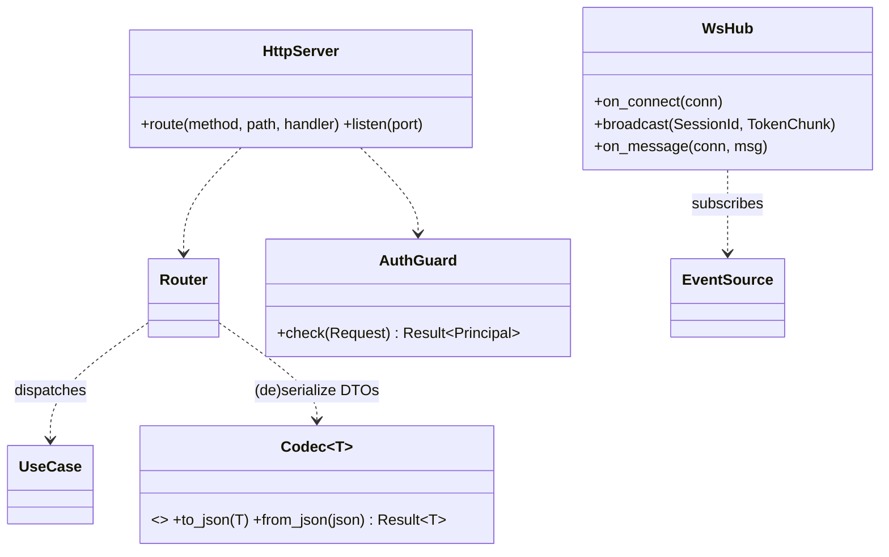

**Modern C++ to try**
- **Concept-based serialization (`Codec<T>`):** constrain "this DTO is
  JSON-(de)serializable" at compile time. With **glaze** you get near-zero-boiler
  reflection-based JSON; with C++26 reflection, even cleaner.
- **Coroutines for connection handling** if the chosen server lib is
  coroutine-native (Drogon/asio) — `co_await` reads/writes, sequential-looking
  handlers.
- **`std::expected` → HTTP status mapping** in *one* place: an `Error`→status
  function, so handlers never hand-roll error responses.
- **Ranges** to transform DTO collections into JSON arrays.

**Challenges / attention**
- **WebSocket lifetime vs. subscriptions.** Each WS connection holds a
  `Subscription` (RAII) to the event bus; closing the socket must drop it.
  Tie subscription lifetime to connection lifetime exactly.
- **Auth on the LAN.** Per the arch doc: shared token, checked in `AuthGuard`
  before routing. Don't scatter auth into handlers.
- **Don't leak transport into `app`.** Handlers map HTTP/WS → DTO → use-case →
  DTO → JSON. If `app` ever sees an HTTP type, the boundary has rotted.
- **Streaming over WS:** the hub subscribes to the bus and forwards
  `TokenChunk`s to the right connection by `SessionId`. Mind ordering and
  partial frames.
- **Threading:** server I/O threads ≠ AI pool threads (arch §5). The bus is the
  safe hand-off between them.

**Class design / decoupling**
- `Router` maps `(method, path)` → a `UseCase`. Adding an endpoint = registering
  a handler; no edits to existing routes (open/closed).
- The server lib sits behind a thin `HttpServer`/`WsHub` interface so swapping
  Crow↔Drogon doesn't touch handlers.

**Alternatives weighed**

| Serialization | Maintainability | Testability | Complexity | Fun/modern |
|---|---|---|---|---|
| **glaze (reflection JSON) behind `Codec`** ✅ | High | High | Med | **High** |
| nlohmann/json (manual `to_json`) | High | High | Low | Med |
| Hand-rolled (today's string scraping) | Low | Low | Low | Low |

| Server lib | Maintainability | Notes |
|---|---|---|
| **Drogon** ✅ (if coroutine handlers wanted) | High | HTTP+WS, coroutine-native, fast. Heaviest dep. |
| Crow | High | Header-friendly, HTTP+WS, simpler. |
| cpp-httplib (+ WS lib) | Med | Simplest HTTP; WS is weaker/bolted-on. |

---

## 8. `aisimd` — composition root

The only module that names concrete types. Wires everything; owns `main()` and
lifecycle.

**Modern C++ to try**
- **Manual dependency injection** (constructor wiring) — no DI framework needed.
  Construct `SqliteStorage`, `OllamaEngine`, `EventBus`, inject into use-cases,
  inject those into the `Router`, start the server.
- **`std::jthread` for the server lifetime**, `stop_token` for graceful
  shutdown on SIGINT/SIGTERM.
- **RAII for the whole process:** an `Application` object whose destructor tears
  down in reverse order (server → app → ai → storage). Deterministic shutdown.
- **`constexpr` config schema** + load-time validation.

**Challenges / attention**
- **Startup ordering & failure:** if Ollama isn't up or the DB can't open, fail
  fast with a clear `Error` (mirror today's "Is Ollama running?" message).
- **Shutdown ordering:** stop accepting connections → drain in-flight streams
  (honor `stop_token`) → flush writer thread → close DB. Get this wrong and you
  corrupt the DB or hang.
- **Single source of wiring** keeps the dependency graph visible in one file —
  a feature, not a chore.

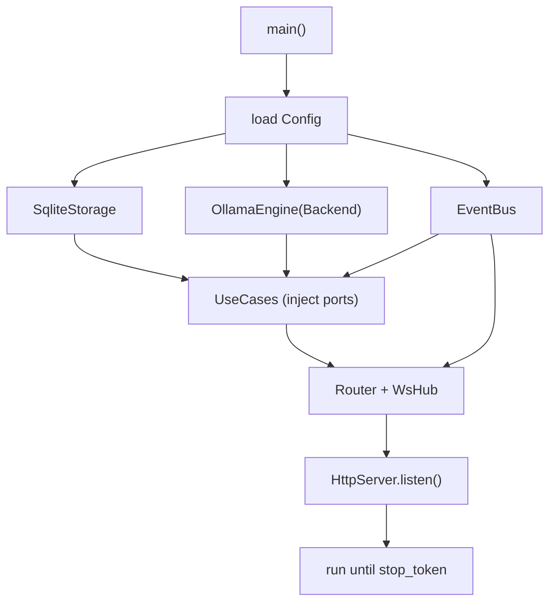

---

## 9. Module dependency graph (the decoupling, at a glance)

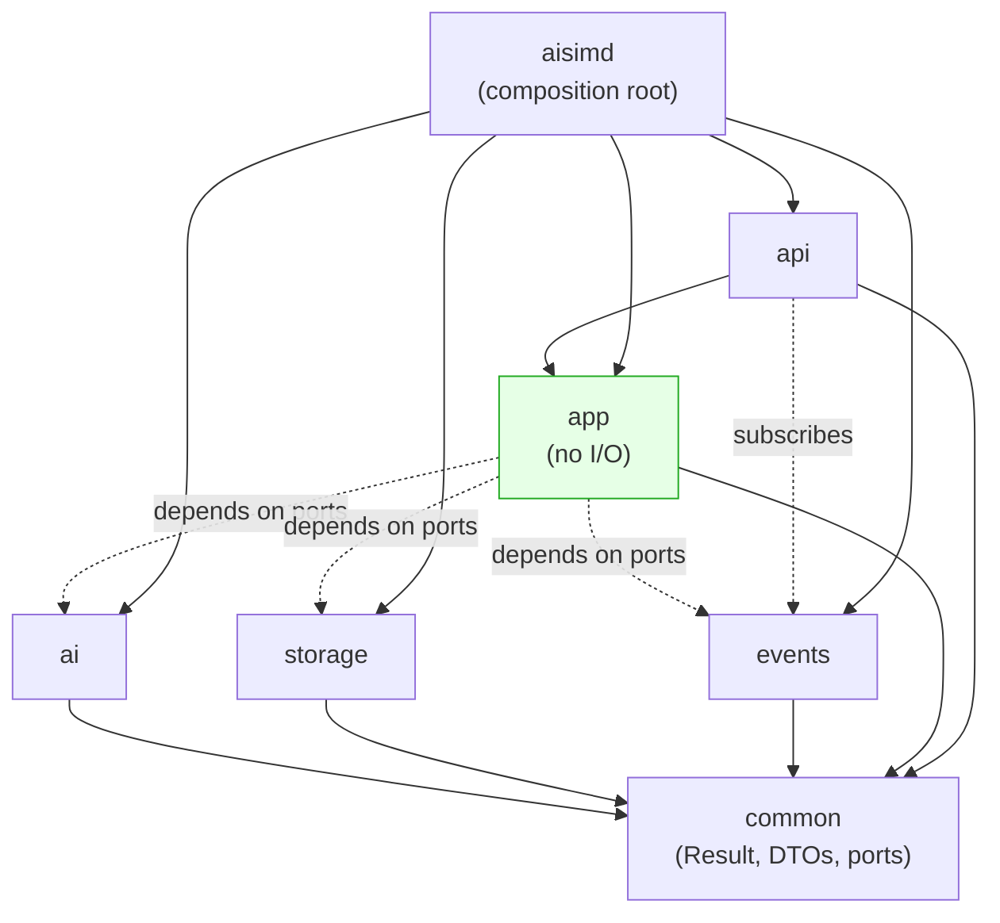

**Read the arrows:** everything points *down* to `common`; `app` depends only on
*ports* (dashed), never concrete `ai`/`storage`; only `aisimd` touches concretes.
Cut any module out and reimplement it — the dashed port lines are the only
contracts to honor. **This is the "evolve without refactoring everything"
property, made structural.**

The **product domain** (skill-gap loop: `TaxonomyService`, `StructuredExtractor`,
`GapService` and the practice/feeder use-cases) lives entirely inside the
green `app` node — pure, port-backed, I/O-free. That placement is deliberate:
the brain of the product is the most-tested, least-coupled module, and swapping
the AI engine or the DB never touches it.

---

## 10. Cross-cutting modern-C++ themes (where each shines)

| Feature | Best home | Payoff | Watch out for |
|---|---|---|---|
| `std::expected` | everywhere | uniform, allocation-free errors | don't smuggle exceptions through it |
| Coroutines (`std::generator`) | `ai` streaming, `storage` large reads | lazy, readable streams | sync-pull vs async-push mismatch (§3) |
| `task<T>`/senders (P2300) | `app`, `ai` async flows | composable async | immature toolchain — adopt cautiously |
| `std::jthread`+`stop_token` | `ai`, `aisimd` | cooperative cancel/shutdown | token must reach curl |
| Concepts | inside modules (`Backend`, `Codec`, `Row`) | zero-overhead, great errors | template ripple in headers |
| Virtual ports | module seams | mockable, ABI-stable, future-proc | vtable cost (negligible here) |
| `std::variant`+`visit` | `events`, `app` dispatch | exhaustive, type-safe routing | visitor boilerplate (use `overloaded`) |
| Ranges | token post-processing, DTO mapping | declarative pipelines | dangling views across threads |
| `std::flat_map`/`mdspan`/`span` | `storage`, hot paths | cache-friendly, copy-free | lifetime of underlying storage |
| `move_only_function` | `events` callbacks | captures move-only state | C++23 lib support |
| Reflection (C++26) | `Codec`, `Row` mapping | kills (de)serialization boilerplate | toolchain availability — keep a manual fallback |

---

## 11. Suggested decision checklist (for you)

When you're ready to build, these are the forks this doc lays out — pick per row:

1. **Port style:** hybrid (virtual seams + inner concepts) ✅ vs. all-concept vs.
   all-virtual.
2. **AI streaming:** `std::generator` + blocking pool thread ✅ vs. callbacks vs.
   full senders.
3. **Storage access:** narrow repositories + UoW ✅ vs. fat DB object.
4. **Event bus:** templated typed bus + RAII subscription ✅ vs. `std::function`
   topics vs. direct callbacks.
5. **Use-cases:** one type per command ✅ vs. fat service.
6. **Serialization:** glaze behind `Codec` ✅ vs. nlohmann manual.
7. **Server lib:** Drogon (coroutines) vs. Crow (simpler) vs. cpp-httplib.
8. **How async to go:** blocking-threads-per-stream (simple, ✅ for one user) vs.
   senders/coroutines throughout (modern, more complex).
9. **Gap/prioritization logic home:** pure `GapService` in `app` ✅ vs. SQL in
   `storage` vs. at the `api` edge.
10. **Skill selection for practice:** `skillSource` strategy seam (manual ↔
    gap-driven by config) ✅ vs. hardcoding one — see ⚠️12 in [`use-cases.md`].
11. **Embeddings:** required vs. **optional capability with string/alias
    fallback** ✅ (keeps the engine-agnostic promise, ⚠️2).

The ✅ marks are the **maintainability-first defaults** — least machinery that
still showcases modern C++ and preserves the evolve-without-refactor seams. The
non-✅ options are there for when you want to push the "fun / cutting-edge" dial
harder on a given module.
```
