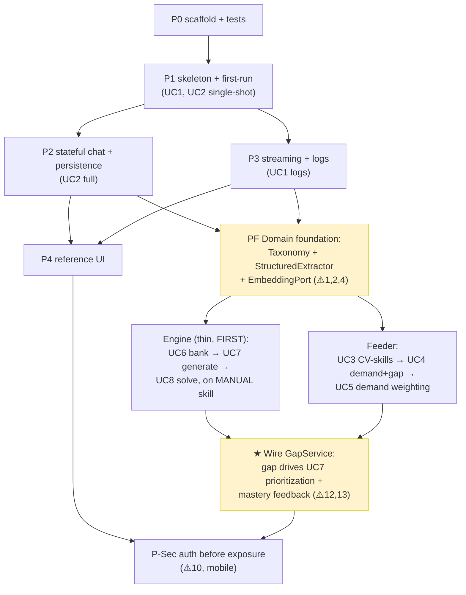
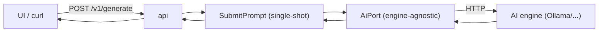
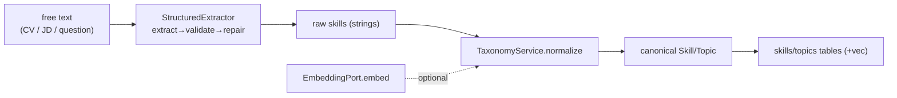
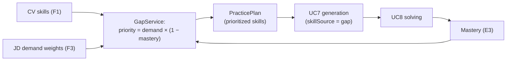

# aisim — Implementation Roadmap (testable end-to-end)

> **Companion to** [[architecture]], [[module-design]], [[use-cases]]. This is
> the *order of work*. Guiding rule: **a walking skeleton first** — a razor-thin
> slice that runs end-to-end (UI → HTTP → Core → AI engine → DB → back) on day
> one — then thicken it one vertical slice at a time. The product is **demoable
> and testable at the end of every phase**, never "integrate at the end".
>
> This version **merges the technical phases with the product use cases**
> (UC1–UC8 in [[use-cases]]). Use-case tags appear as `(UC#)`. The consistency
> fixes from [[use-cases]] §3 are baked into the ordering — most importantly the
> **Skill/Topic taxonomy** and **structured-extraction** foundation that the use
> cases imply but never name.
>
> Paste into Obsidian; `- [ ]` items render as checkboxes and roll up in queries.

## Legend
- `- [ ]` task · `- [x]` done · `🧪` test · `🎯` milestone/DoD
- Difficulty: 🟢 easy · 🟡 medium · 🔴 hard/uncertain
- Tags: #infra #ai #storage #api #app #events #ui #test #docs #domain
- `(UC#)` = the use case a task serves · `⚠️#n` = consistency issue from [[use-cases]]

---

## Map: use cases → phases

> **North star ([[use-cases]] §0):** the product is **code practice driven by
> the skill gap** — the skills the user's target jobs demand minus the skills
> they already have. Career analysis is a **feeder**, not a co-equal pillar. **No
> interview/career coaching.**

**Critical path to a useful product:** P0 → P1 → P2 → P3 → P4 → PF.
Then the deliberately-sequenced domain work:
1. **Thin Practice Engine first** (UC6→UC7→UC8 on a *manually chosen* skill) —
   proves the hard practice loop, especially UC8, without waiting on the feeder.
2. **Feeder** (UC3→UC4→UC5) — turns CV + job descriptions into the skill gap.
3. **Wire `GapService`** — the gap now *drives* what the engine generates and
   how it's prioritized (`priority = demand × (1 − mastery)`), closing the loop.

This ordering de-risks the hardest piece (UC8) early and defers the
gap-prioritization wiring until both halves exist.

---

## Phase 0 — Scaffolding & test harness #infra
*So every later phase has somewhere to land.*

- [ ] Restructure into module targets per [[module-design]] (`common`, `ai`, `storage`, `events`, `app`, `api`, `aisimd`) #infra 🟢
- [ ] Each module = static-lib target with a public `include/` dir #infra 🟢
- [ ] Test framework (Catch2/GoogleTest) wired to `ctest` #test 🟢
- [ ] `clang-debug` build with ASan/UBSan in a local CI script #infra 🟢
- [ ] **Enforce architecture in CMake:** `app` does not link curl/sqlite (can't do I/O) #infra 🟡
- [ ] `common`: `Result<T>`, `Errc`, strong-typedef `Tagged<T,Tag>`, `ILogger`+`Null/Console` #infra 🟢
- [ ] 🧪 Per-module build/link smoke test #test 🟢
- [ ] 🎯 **DoD:** `ctest` green across targets, ASan clean #infra

---

## Phase 1 — Skeleton + first run (UC1, UC2 single-shot) #api #ai #app #infra
*Goal: first-run identity + config, an **engine-agnostic** AI port, one prompt round-trips. Testable via fake backend + real engine E2E.*

**First run & config (UC1)**
- [ ] (UC1) First-run flow: capture **mandatory name**; persist `User` #app 🟢
- [ ] (UC1, ⚠️8) Config at **`~/.config/aisim/`**, data at `~/.local/share/aisim/`; `--data-dir` override. *(Not relative `./config` — breaks on launcher cwd.)* #infra 🟡
- [ ] (UC1) Config layering: defaults → file → env (keep `OLLAMA_HOST`) #infra 🟢
- [ ] (UC1, ⚠️9) Structured logging to file + `GET /v1/logs/tail` endpoint *(log **window** deferred to UI polish)* #infra 🟢

**Engine-agnostic AI (UC1, ⚠️2, ⚠️5)**
- [ ] Define `AiPort` (virtual seam) + `PromptRequest`/`GenParams` (incl. `model`) DTOs #ai 🟢
- [ ] (⚠️2) Add `AiPort::capabilities() -> Capabilities` (streaming? embeddings? JSON mode?) — agnosticism = graceful degradation, not "all engines do all" #ai 🟡
- [ ] Implement `OllamaEngine` behind `AiPort` from today's `Backend`/`OllamaBackend` #ai 🟡
- [ ] (⚠️5) Config maps **task → preferred model** (coder vs general) — don't assume one model serves all UCs #ai 🟢
- [ ] Real JSON parse inside `ai` (port stays JSON-free) #ai 🟡
- [ ] `FakeBackend` (deterministic, no network) #ai #test 🟢

**Edge + use-case**
- [ ] `api`: embed HTTP server; `POST /v1/generate`, `GET /health`, `GET /v1/version` #api 🟡
- [ ] `SubmitPrompt` use-case (single-shot, no history yet) over `AiPort` #app 🟢
- [ ] `aisimd` composition root: build engine, inject, mount routes, `listen()` #app 🟢

**Tests**
- [ ] 🧪 Unit: first-run rejects empty name; creates config files at XDG paths #test 🟢
- [ ] 🧪 Unit: `SubmitPrompt` + `FakeBackend` returns expected reply #test 🟢
- [ ] 🧪 Unit: `OllamaEngine` maps engine error body → `Error`; `capabilities()` reflects a stub engine #test 🟢
- [ ] 🧪 E2E: `POST /v1/generate` against **real local engine** → 200 + non-empty #test 🟡
- [ ] 🧪 E2E: engine down → `/health` degraded #test 🟢
- [ ] 🎯 **MILESTONE:** fresh user → names themselves → asks one question → gets a model answer; engine swappable behind `AiPort` #api

---

## Phase 2 — Stateful chat + persistence (UC2 full) #storage #app
*Goal: multi-turn conversation that remembers context and survives restarts. Fixes ⚠️3 (stateless skeleton can't "continue the chat").*

- [ ] RAII `sqlite3*`/`stmt*` wrappers; open DB; **WAL mode** #storage 🟡
- [ ] Migration runner (`PRAGMA user_version`); v1 = settings, users, conversations, turns #storage 🟡
- [ ] `SessionStore`/`SettingsStore` (narrow interfaces) + `Conversation`/`Turn`/`Setting` DTOs #storage 🟢
- [ ] **Single writer thread** + queue; reader connections #storage 🔴
- [ ] (UC2, ⚠️3) **Context assembly**: load prior turns → bounded context window; truncate/summarize long inputs (e.g. large C++ files) #app 🔴
- [ ] (UC2) `SubmitPrompt` evolves: append user turn → assemble context → generate → append assistant turn (atomic / UoW) #app 🟡
- [ ] `OpenSession`, `UpdateSettings` use-cases; `POST /v1/sessions`, `GET /v1/sessions/{id}/history`, settings routes #api #app 🟢
- [ ] 🧪 Unit: storage round-trips conversation + turns (in-memory DB) #test 🟢
- [ ] 🧪 Unit: context assembly truncates an over-long file deterministically #test 🟡
- [ ] 🧪 Unit: multi-turn `SubmitPrompt` w/ `FakeBackend` carries prior turns into the prompt #test 🟡
- [ ] 🧪 E2E: explain a C++ file → ask a follow-up → answer reflects earlier context; restart → history survives #test 🟡
- [ ] 🧪 Concurrency: N-thread write storm, no `SQLITE_BUSY`/corruption (TSan) #test 🔴
- [ ] 🎯 **DoD (UC2):** real multi-turn chat about a code file, persisted across restarts #storage

---

## Phase 3 — Live streaming + logs view (UC1 logs) #events #ai #api
*Goal: tokens stream live; log-tail visible. Fixes ⚠️6's prerequisite (streaming needed before UC8 hints).*

- [ ] `AiPort::stream(...) -> std::generator<TokenChunk>`; `OllamaEngine` sets `"stream":true`, yields from write callback #ai 🔴
- [ ] **Cancellation:** `stop_token` aborts the transfer #ai 🔴
- [ ] `events`: templated `EventBus<E>`, `EventSink`/`EventSource`, **RAII `Subscription`** #events 🟡
- [ ] Publish via bounded queue hand-off (documented threading) #events 🟡
- [ ] `SubmitPrompt`: consume generator → publish chunks → persist final turn #app 🟡
- [ ] `api`: WebSocket `/v1/stream`; `WsHub` subscribes, forwards by `SessionId`; subscription tied to connection #api 🔴
- [ ] Slow-consumer backpressure: bounded per-subscriber queue + drop/disconnect policy #events 🟡
- [ ] 🧪 Unit: bus fan-out; dropping `Subscription` stops delivery (ASan, no UAF) #test 🟡
- [ ] 🧪 Unit: cancel mid-stream → generator stops, no leaked thread/handle (TSan/ASan) #test 🔴
- [ ] 🧪 E2E: WS client gets incremental tokens; final history row = concatenation #test 🟡
- [ ] 🎯 **DoD:** live token streaming with working cancel; leak-clean #events

---

## Phase 4 — Reference UI & stable API #ui #api #docs
*Goal: a real minimal UI drives chat end-to-end; `/v1` frozen. Replaces old CLI.*

- [ ] Freeze public API: `/v1` routes, DTO schemas, `Error`→HTTP-status map in one place #api 🟡
- [ ] Minimal reference UI (chosen toolkit): name on first run, new session, prompt, **streamed** reply, history #ui 🔴
- [ ] (UC1) Log **window** (the deferred UI piece) reading `/v1/logs/tail` #ui 🟢
- [ ] Old `main.cpp` → thin `aisim-cli` client (or `aisimd --oneshot` debug) #api 🟡
- [ ] API reference doc (endpoints, payloads, WS shapes) #docs 🟢
- [ ] 🧪 E2E (UI/headless): send→stream→history happy path #test 🟡
- [ ] 🧪 Contract: golden JSON per endpoint #test 🟡
- [ ] 🎯 **MILESTONE — usable chat product:** type → watch stream → history persists, over stable v1 #ui

---

## Phase PF — Domain foundation: Taxonomy + structured extraction + embeddings
*The piece your use cases imply but never name. Gates both the Engine and the Feeder. Fixes ⚠️1, ⚠️2, ⚠️4.* #domain #ai #storage

- [ ] (⚠️4) `StructuredExtractor<T>`: prompt → parse → **validate against schema → repair/retry**; degrade to raw text + user-correctable #ai 🔴
- [ ] (⚠️4) Golden-sample test set (CVs/JDs/questions) measuring extraction reliability #test 🟡
- [ ] (⚠️1) `TaxonomyService`: canonical `Skill`/`Topic` + **alias normalization** ("JS"→"JavaScript", "C++17"→"C++") #domain 🔴
- [ ] (⚠️1) Skills/topics tables; every extraction normalizes into them #storage 🟡
- [ ] (⚠️2) `EmbeddingPort` (optional capability; possibly a *different* model); load **`sqlite-vec`**; vector table (dim matches model) #ai #storage 🔴
- [ ] (⚠️2) `TaxonomyService` uses embeddings for semantic skill matching *when available*, falls back to string/alias match #domain 🟡
- [ ] 🧪 Unit: extractor repairs malformed JSON; falls back gracefully on garbage #test 🟡
- [ ] 🧪 Unit: taxonomy normalizes aliases; same skill from two sources → one canonical id #test 🟡
- [ ] 🧪 Unit: vector search returns nearest skills/topics (temp DB) #test 🟡
- [ ] 🎯 **DoD:** any free text → reliable canonical skills/topics, with or without an embedding-capable engine #domain

> Why here and not later: gap computation, skill indexing, and task-matching are
> **incoherent without one canonical vocabulary**. Building taxonomy "later"
> means re-keying all prior data. (See ⚠️1.)

---

## Practice Engine (FIRST) — UC6 → UC7 → UC8 #domain
*The product itself. Built first on a **manually chosen skill** so the hard
practice loop (esp. UC8) is proven before the feeder exists. Gap-driven
prioritization is wired in later (Phase Gap).*

### Phase E1 — Task bank (UC6)
- [ ] (UC6, ⚠️7) `TaskStore` + `Task` DTO **with provenance** (`user_submitted`/`generated`) + skill/topic links + optional reference solution #storage 🟢
- [ ] (UC6) `POST /v1/tasks`: extract involved **skills/topics** (normalized) → index #domain 🟡
- [ ] (UC6) UI lists/sorts tasks by skill #ui 🟢
- [ ] 🧪 E2E: submit a task → correct skills inferred → appears under those skills #test 🟡
- [ ] 🎯 **DoD (UC6):** task bank indexed by canonical skill/topic #domain

### Phase E2 — Task generation (UC7, manual-skill mode)
- [ ] (UC7) Generate coding tasks for a **chosen skill** → persist into `TaskStore` (provenance=`generated`) #domain 🟡
- [ ] (UC7) UI: pick a skill → see/generate tasks #ui 🟢
- [ ] (UC7, ⚠️12) *Note:* skill source is **manual now**; switches to **gap-driven** in Phase Gap — keep selection behind a `skillSource` seam so the swap is config, not a rewrite #domain 🟢
- [ ] 🧪 E2E: pick a skill → generated tasks appear and are stored, reusable by UC8 #test 🟡
- [ ] 🎯 **DoD (UC7):** generated practice flows into the shared task store #domain

### Phase E3 — Guided solving with live feedback (UC8) — highest risk
- [ ] (UC8, ⚠️6) Select a task; UI code editor with **debounced snapshots** (on pause/save/"review"), **not per-keystroke** #ui 🔴
- [ ] (UC8) Stream snapshot → model → **non-intrusive hints**: correctness, wrong-direction, idioms, perf, memory, extra copies #domain 🔴
- [ ] (UC8) **Rate-limit / dedupe hints** so guidance stays non-intrusive #domain 🟡
- [ ] (UC8) `MasteryStore`: solving updates a per-skill **mastery score** (feeds Phase Gap) #storage 🟡
- [ ] (UC8) Persist `Solution` + feedback history #storage 🟢
- [ ] 🧪 E2E: solve a task; deliberately write a wrong/wasteful version → relevant hint fires; correct version → fewer hints; mastery updates #test 🔴
- [ ] 🎯 **DoD (UC8):** live, debounced, non-intrusive coaching; mastery tracked #domain

> Scheduled as the engine's last step (⚠️6): needs streaming (P3) + the task
> store (E1/E2), the most UI work, and the trickiest "non-intrusive" tuning.
> **Milestone: a fully usable practice tool** (on manually chosen skills) exists
> here — before the feeder.

---

## Feeder — Skill intelligence (UC3 → UC4 → UC5) #domain
*Turns CV + job descriptions into the skill gap. **No interview/career
coaching** — CV is used only to extract skills the user HAS. Independent of the
Engine until Phase Gap.*

### Phase F1 — CV → skills the user HAS (UC3, de-scoped)
- [ ] (UC3) `CvStore` + `CV`/`Experience` DTOs; `POST /v1/cv` (plain-text upload) #storage #api 🟢
- [ ] (UC3) Parse CV via `StructuredExtractor` → experiences + **normalized skills the user HAS**; save #domain 🟡
- [ ] (UC3) Seed `MasteryStore` with a baseline mastery for CV-evidenced skills #domain 🟢
- [ ] (UC3, §0) ~~Generate per-job interview questions~~ **DROPPED** — interview prep is out of scope #domain
- [ ] (UC3) UI: CV upload + "skills detected" view (no interview tab) #ui 🟢
- [ ] 🧪 E2E: upload CV → skills extracted, normalized to canonical ids, mastery seeded #test 🟡
- [ ] 🎯 **DoD (UC3):** CV yields the user's canonical skill set #domain

### Phase F2 — JD → demand + gap (UC4)
- [ ] (UC4) `JobStore` + `JobDescription`/`SkillDemand` DTOs; `POST /v1/jobs` #storage #api 🟢
- [ ] (UC4) Extract JD → **demanded skills** (normalized) with per-JD weight #domain 🟡
- [ ] (UC4, ⚠️13) Per-JD **gap = demanded − has**; offer a **practice plan** (ordered coding tasks, not a reading syllabus) #domain 🟡
- [ ] (UC4) UI: JD paste, gap view, "build a practice plan" action #ui 🟡
- [ ] 🧪 E2E: paste JD → gap references canonical skills the CV lacks → practice plan = ordered tasks #test 🟡
- [ ] 🎯 **DoD (UC4):** single-JD gap + practice plan, persisted #domain

### Phase F3 — Many JDs → demand weighting (UC5, reframed)
- [ ] (UC5, ⚠️1) Store N JDs; **aggregate demand by frequency** across jobs of interest via canonical skills #domain 🔴
- [ ] (UC5) Produce a **demand-weight per skill** (how often the user's target jobs want it) — replaces "fulfillment %" #domain 🟡
- [ ] (UC5) UI: most-demanded-skills view across saved JDs #ui 🟡
- [ ] 🧪 E2E: add 3 JDs → overlaps aggregate on canonical skills (not raw strings, ⚠️1) → demand weights computed #test 🟡
- [ ] 🎯 **DoD (UC5):** cross-JD demand weighting drives prioritization (not a career score) #domain

---

## Phase Gap — Wire the gap into the engine (⚠️12, ⚠️13) #domain
*The north-star payoff: the gap now DRIVES practice. Connects Feeder → Engine.*

- [ ] `GapService.computeGap(user)` → `vector<SkillGap>` with `priority = demand × (1 − mastery)` #domain 🟡
- [ ] `GapService.practicePlan(user)` → ordered skills; `GET /v1/plan` #domain #api 🟡
- [ ] Flip UC7's `skillSource` seam from **manual** → **gap-driven** (config default) #domain 🟢
- [ ] Re-prioritize after each solve (mastery↑ → priority↓ → next skill surfaces) #domain 🟡
- [ ] UI: "what to practice next" driven by the plan #ui 🟢
- [ ] 🧪 E2E: CV + 3 JDs → high-demand/low-mastery skill ranks first → generates its tasks → solving it lowers its next-priority #test 🔴
- [ ] 🎯 **MILESTONE — the product realized:** practice is automatically driven by *"what you need to get the jobs you want, minus what you already know."* #domain

---

## Phase Sec — Security before exposure (⚠️10) #api #infra
*CVs/JDs are sensitive personal data. The moment the API is LAN/mobile-reachable, this MUST be in place. For THIS app, auth is not deferrable like it might be for a generic chat tool.*

- [ ] Shared auth token generated on first run; stored in config #infra 🟢
- [ ] `AuthGuard` checks token before routing (HTTP + WS handshake) #api 🟡
- [ ] Bind localhost by default; explicit opt-in LAN bind #infra 🟢
- [ ] Pairing UX: desktop shows token/QR for the phone #ui 🟡
- [ ] (LAN) TLS for non-localhost; document trust model #infra 🔴
- [ ] (⚠️10) Consider at-rest protection for CV/JD data #infra 🟡
- [ ] Minimal mobile client (Kotlin/Swift) on the same `/v1` API + WS #ui 🔴
- [ ] 🧪 E2E: unauth request → 401; valid token → accepted; second LAN device sends a command #test 🟡
- [ ] 🎯 **DoD:** no sensitive endpoint reachable without auth; mobile/LAN works #api

---

## Phase R — Robustness & polish (ongoing) #infra #test
- [ ] Graceful shutdown: stop accepting → drain streams (`stop_token`) → flush writer → close DB #infra 🔴
- [ ] Bounded AI executor/thread pool replaces per-request thread spawning #ai 🟡
- [ ] `/health` exposes Core + engine + DB status #infra 🟢
- [ ] Whole suite under TSan + ASan/UBSan in local CI #test 🟡
- [ ] Fuzz/property test the JSON codec & API inputs #test 🟡
- [ ] Soak test: long session, many streams, watch leaks/fd growth #test 🔴
- [ ] 🎯 **DoD:** clean shutdown, bounded resources, sanitizer-clean #infra

---

## Testing strategy (every phase)
- [ ] **Unit** — use-cases/modules tested with **fakes** through ports (`FakeBackend`, in-memory DB, scripted events, stub `StructuredExtractor`). Fast, no network.
- [ ] **E2E** — start `aisimd`, drive over HTTP/WS against a **real local engine**. Each phase adds one happy-path + one failure-path.
- [ ] **Extraction quality** — golden CV/JD/question samples scored for structured-output reliability (the product's biggest quality risk, ⚠️4).
- [ ] **Contract** — golden JSON guards the public API (from P4).
- [ ] **Concurrency/sanitizer** — TSan (writer thread, event bus), ASan (streaming/subscription lifetimes).

> Because every dependency sits behind a port, **the fake is always cheaper than
> the real thing** — the [[module-design]] decoupling cashed in as a fast,
> deterministic suite.

---

## What changed because of the north star + use cases (vs. the generic roadmap)
See [[use-cases]] §0 (north star) and §3 (full reasoning). Headlines:
1. **Product is the practice engine driven by the skill gap.** Career analysis is a **feeder**, not a co-equal pillar (§0).
2. **Engine built FIRST on a manually chosen skill**, then the feeder, then the gap is wired in (Phase Gap) — de-risks UC8 without waiting on CV/JD work.
3. **`GapService` is the new core:** `priority = demand × (1 − mastery)` (⚠️12, ⚠️13). Old "fulfillment %" and "professional profiles" → **demand weighting** for prioritization.
4. **No interview/career coaching:** UC3's per-job interview questions **dropped**; CV used only to extract skills the user HAS; UC4 "study plan" → **practice plan** (ordered coding tasks) (§0, ⚠️13).
5. **Taxonomy + structured extraction promoted to a foundation phase (PF)** — implied, owned by none; building it late means re-keying data (⚠️1, ⚠️4).
6. **Embeddings/RAG promoted** into PF via an **optional `EmbeddingPort` + `capabilities()`** (⚠️2).
7. **First-run, config (XDG not `./config`), engine-agnostic port, logs** folded into P1 (UC1, ⚠️8, ⚠️9).
8. **Stateful chat + context assembly** explicit in P2 (UC2, ⚠️3); **per-task model routing** acknowledged (⚠️5).
9. **UC8 scheduled as the engine's last step** with debounced (not per-keystroke) analysis (⚠️6).
10. **Auth mandatory-before-exposure**, not deferrable, due to sensitive CV/JD data (⚠️10).
