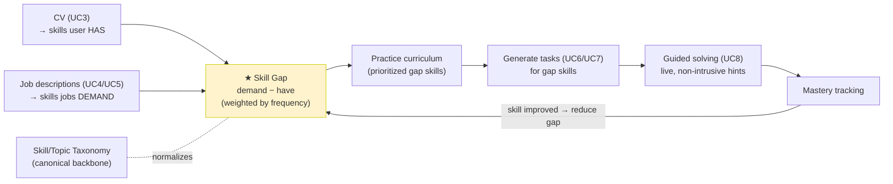
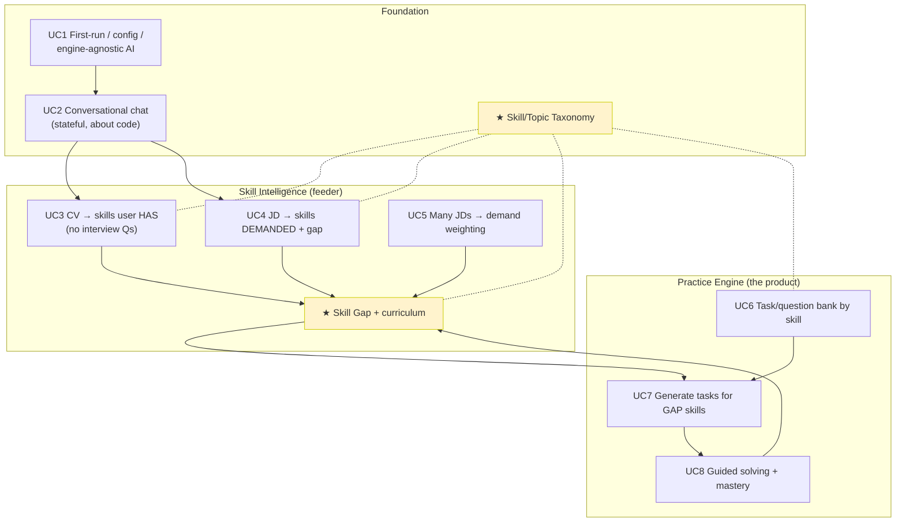
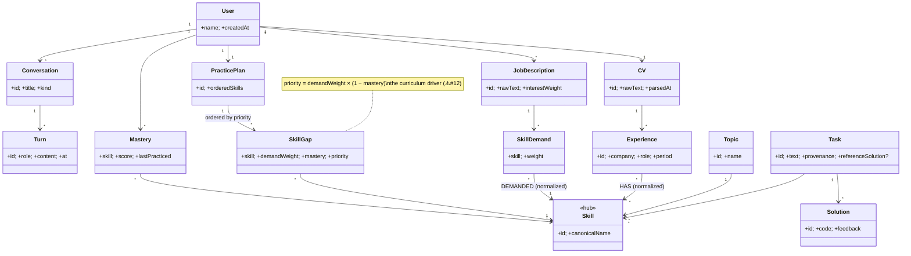
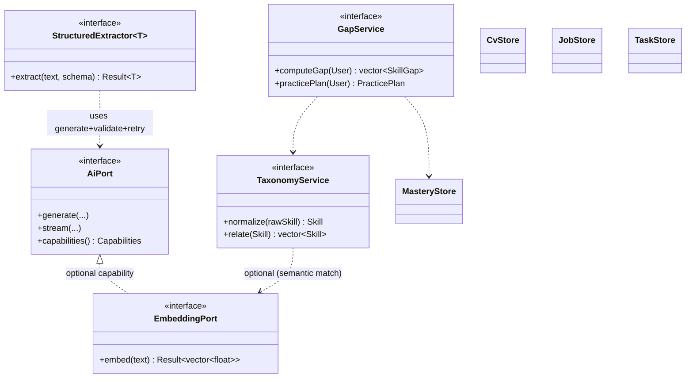

# aisim — Use Cases, Domain Model & Consistency Analysis

> **Companion to** [[architecture]], [[module-design]], [[roadmap]].
> This doc does three things:
> 1. Records the **use cases** (UC1–UC8) as the product intent.
> 2. **Flags inconsistencies / risks** (design, functionality, ordering) so they
>    are decided deliberately, not by accident.
> 3. Derives the **domain model** and the **correct build order**, which is then
>    merged into [[roadmap]].
>
> **Key reframing:** the original architecture docs assumed a *generic AI chat
> harness*. The use cases describe a **personal coding-practice companion**. The
> transport/module architecture still holds; what changes is the *domain layer*
> (`app`) and the order of work.

---

## 0. Product north star (confirmed by the user)

> **The main goal is code practice** driven by **(a) the user's existing
> skills** and **(b) the skills demanded by job descriptions the user is
> interested in**. The aim is the **technical knowledge needed to *get* the
> job** — **not** interview coaching, behavioral prep, or career advice.

Two consequences that reshape everything below:

1. **One engine, not two pillars.** Career analysis is **not** a co-equal pillar
   — it is a **feeder** that computes the practice curriculum. CV + job
   descriptions exist only to produce one thing:

   > **Target skills = (skills the jobs require) − (skills the user already
   > has)** — weighted by how often a skill appears across the user's jobs of
   > interest.

   That gap *is* the curriculum. The **coding-practice loop** (generate tasks
   for gap skills → solve with live feedback → track mastery → re-prioritize) is
   the product. Everything else aims it.

2. **"No interview coaching" removes/retargets parts of the original UCs.**
   - UC3's "generate **questions about your experience in each job**" is
     behavioral/interview prep → **dropped**. The CV is used *only* to extract
     **skills the user already possesses**, to subtract from the gap.
   - UC5's "professional profiles / fulfillment %" is reframed from a
     career-fit score into **skill-demand weighting** for practice
     prioritization.

### The system as one loop

The **Skill Gap** is the new center of gravity (it absorbs the old "fulfillment
%" idea). The **Taxonomy** remains the backbone that makes "demand", "have", and
"task topic" comparable — see Inconsistency #1.

---

## 1. Feeder → Engine (not two pillars)

Re-cast from the earlier "two pillars" view to match the north star: a **Skill
Intelligence feeder** produces the gap; the **Practice Engine** consumes it.

> **Build-order implication:** the feeder and engine are **no longer
> independent pillars you can pick between**. The engine's *value* depends on the
> gap. But you can still build a **thin engine first** (practice on
> manually-chosen skills) and wire the **gap-driven prioritization** in once the
> feeder lands — see [[roadmap]].

---

## 2. The use cases (as given, lightly normalized)

> Re-cast to the north star (§0). "Pillar" → **role**: Foundation, **Feeder**
> (skill intelligence), or **Engine** (practice). Struck-through text is removed
> by "no interview coaching".

| UC | Title | Essence (re-cast) | Role |
|---|---|---|---|
| **UC1** | First run | Mandatory name; create config; connect to an **engine-agnostic** AI; viewable logs | Foundation |
| **UC2** | Chat about code | Prompt → explain a C++ file → continue the conversation | Foundation |
| **UC3** | CV ingest | Load CV text; extract **skills the user HAS** (→ taxonomy). ~~Generate per-job interview questions~~ *(dropped: interview prep)* | Feeder |
| **UC4** | Job description | Paste JD; extract **demanded skills**; **gap = demand − have**; offer a **study/practice plan**; save | Feeder |
| **UC5** | Many JDs | N JDs → **weight skill demand by frequency** across jobs of interest. ~~career fulfillment %~~ → **practice prioritization** | Feeder |
| **UC6** | Task bank | Submit task/question text; model infers skills/topics (normalized); store indexed by skill; UI lists skills | Engine |
| **UC7** | Generate practice | Generate coding tasks for skills — **prioritized by the gap** (skills needed to get the job), not only skills already held *(see #12)* | Engine |
| **UC8** | Guided solving | Select a task; model watches edits live; non-intrusive hints (correctness, idioms, perf, memory, copies); **update mastery** | Engine |

---

## 3. Inconsistencies, risks & ordering problems

> Ordered by impact. ⚠️ = decide before building the affected use case.

### ⚠️ #1 — The Skill/Topic taxonomy is implied everywhere but owned nowhere
Skills/topics are extracted **independently** in UC3 (from CV), UC4 (from JD),
UC6 (from questions), and UC7 (training selection). Nothing reconciles them.
Without a **single canonical vocabulary + normalization** (e.g. "JS" → "JavaScript",
"modern C++"/"C++17" → "C++"), then:
- UC5 correlation across JDs produces noise (same skill, different strings).
- UC5 "how much the user fulfills a profile" can't be scored consistently.
- UC7 "skills the user already has" can't be matched to question topics in UC6.

**Resolution:** build a **Taxonomy service** (canonical `Skill`/`Topic` + alias
normalization) as *foundation*, before UC5 and UC7. Every extraction (CV, JD,
question) normalizes into it. This reorders the work — taxonomy is **not**
emergent from UC5; it precedes it.

### ⚠️ #2 — "Engine-agnostic" collides with embeddings & structured output
UC1 demands agnosticism to AI engine/model. But:
- UC6 (index by topic) and any semantic search need **embeddings** — not every
  provider offers them.
- UC3/UC4/UC6 need **structured output** (JSON of jobs/skills/gaps) — providers
  differ in JSON-mode/function-calling support.

A bare `generate(prompt)` port can't express "does this engine support
embeddings / JSON mode / streaming?".

**Resolution:** the `AiPort` needs **capability discovery** (a `Capabilities`
query) and optional sub-interfaces (`EmbeddingPort`). The embedding model may be
a *different* model than the chat model. Agnosticism = "any engine, but features
degrade gracefully when a capability is absent," not "every engine does
everything."

### ⚠️ #3 — Stateless skeleton vs. UC2's "continue the chat"
UC2 requires multi-turn memory and assembling prior turns into the context
window. A simple file explanation can also exceed the model's context for large
files.

**Resolution:** introduce a **Conversation/context-assembly** concept early
(history → bounded context, with truncation/summarization for long inputs). The
walking-skeleton single-shot `SubmitPrompt` must evolve into a context-aware
flow *before* UC3's per-job Q&A (which is itself a structured conversation).

### ⚠️ #4 — Structured extraction is non-deterministic and model-dependent
UC3 ("save CV information", "basic analysis"), UC4 ("understand the JD", "find
gaps"), and UC6 ("understand the skills involved") all rely on the LLM returning
**reliable structured data**. With a local 7B model this is the biggest quality
risk in the product.

**Resolution:** an **Extract → Validate (against schema) → Repair/retry**
pipeline, with graceful degradation (store raw text + best-effort structure;
let the user correct it). Define precisely what "basic analysis" yields. Treat
extraction quality as a first-class, *testable* concern (golden CV/JD samples).

### ⚠️ #5 — Model specialization mismatch
The configured model is **qwen2.5-coder:7b** — a *coding* model. UC3–UC5 are
career/NLP analysis, where a general-instruct model is better; UC2/UC7/UC8 want
the coder model. Engine-agnosticism *enables* per-task model routing, but that
must be designed in.

**Resolution:** **per-use-case model selection** (already supported by
`GenParams.model`), plus a config mapping "task → preferred model". Don't assume
one model serves all 8 use cases.

### ⚠️ #6 — UC8 real-time analysis: feasibility & "non-intrusive" tension
"Reads changes in real time" + "non-intrusive" + a local 7B model are in
tension: re-running the model on every keystroke is slow, expensive, and noisy
(the opposite of non-intrusive). It also requires a **code editor with diff/
snapshot streaming** in the UI — significant client work.

**Resolution:** **debounced snapshots** (analyze on pause / on explicit "review"
/ on save), not per-keystroke. Rate-limit hints. This is the **highest-risk,
highest-cost** use case → schedule it **last**, after streaming + practice store
are proven.

### #7 — Question-store ambiguity (UC6 vs UC7 vs UC8)
UC6 stores **user-submitted** questions; UC7 **generates** questions; UC8 solves
questions from "the saved database". Are generated questions persisted into the
same store UC8 reads?

**Resolution:** one **`Question` entity with provenance** (`user_submitted` vs
`generated`) + skill/topic links + optional reference solution. UC7's output
flows into the same store UC8 reads.

### #8 — Config path is relative and mixes config with data
UC1 says config under `./config/aisim` — a **relative** path depends on the
launch directory (breaks when started from a launcher/another cwd), and lumps
config with the SQLite DB.

**Resolution:** XDG defaults — config in `~/.config/aisim/`, data/DB in
`~/.local/share/aisim/`; allow an explicit `--data-dir` override for a portable
mode. Don't default to a relative path.

### #9 — Logs *window* over-prioritized at first run
UC1 bundles a log-viewing **window** into first-run. A log *file*/endpoint is
cheap and should exist early; the windowed viewer is UI polish and shouldn't
gate first-run.

**Resolution:** ship structured logging + a log-tail endpoint in foundation; the
log **window** is a later UI nicety.

### #10 — Privacy / sensitive data vs. LAN/mobile exposure
CVs and job descriptions are sensitive personal data. The moment the API is LAN/
mobile-reachable, this data is exposed. For a *generic* chat app, auth could be
deferred; for *this* app it can't.

**Resolution:** auth-before-exposure is mandatory; consider at-rest protection.
Auth moves up relative to the generic plan if/when LAN is enabled.

### ⚠️ #12 — UC7 contradicts the north star: "skills you HAVE" vs "skills you NEED"
*(Surfaced by the confirmed goal in §0.)* UC7 as originally written says "pick a
skill the user **already has** → generate questions." But the product goal is the
**knowledge needed to *get* the job** — i.e. skills the user is **missing or
weak in** (the gap from UC4/UC5). These point in opposite directions:
- Practicing only skills you already have doesn't close the gap to the job.
- Practicing pure unknowns with zero foundation can be demoralizing/ineffective.

**Resolution:** practice is **prioritized by the skill gap**, not by what you
already know. Concretely, rank practice targets by a blend:
`priority = demand_weight (UC5) × (1 − mastery)` — i.e. **high-demand,
low-mastery** skills first. Skills you already have score low (high mastery →
low priority) and serve mainly as warm-up/calibration. "Train a skill I have" is
demoted to an **optional manual override**, not the default driver.

### #13 — "Study plan" (UC4) reframed as a practice plan
With no interview/career coaching, UC4's "logical plan of study" is **not** a
reading/learning syllabus — it's a **prioritized sequence of coding tasks** over
the gap skills (output of the same prioritization as #12). It feeds UC7/UC8
directly rather than producing prose advice.

### #11 — Ordering verdict (revised for the north star)
The implicit order (UC1→…→UC8) is **mostly sound**, with these corrections:
- Insert **Taxonomy** (foundation) **before** the gap computation (#1).
- Land **capability discovery + embeddings** (#2) before skill indexing (UC6).
- Land **stateful chat / context assembly** (#3) and **structured-extraction
  infra** (#4) before CV/JD ingestion (UC3/UC4).
- **Feeder and Engine are no longer independent pillars.** The Engine's *value*
  comes from the gap the Feeder produces (§1). **But** you can build a **thin
  Engine first** (UC6 + UC7 + UC8 on *manually chosen* skills) to validate the
  hard practice loop, then connect **gap-driven prioritization** (#12) once the
  Feeder (UC3→UC4→UC5) lands. This de-risks UC8 (the hardest piece) without
  waiting on the whole feeder.
- **Recommended sequence:** Foundation → thin Engine (manual skill) → Feeder →
  wire gap into Engine prioritization. (See [[roadmap]].)

---

## 4. Domain model (entities & relations)

Shallow on fields (per your earlier preference); focused on relationships and
the shared taxonomy backbone.

Re-cast to the north star: `Skill` is the hub, **`SkillGap`** is the center of
gravity, and `Mastery` closes the loop. Interview-prep entities are gone.

**The loop:** `Experience→Skill` (HAS) and `JobDescription→SkillDemand→Skill`
(DEMANDED) feed `SkillGap`; `SkillGap` ordered = `PracticePlan`; solving a
`Task` updates `Mastery`, which feeds back into `SkillGap.priority`. Every
free-text source **normalizes into the canonical `Skill`/`Topic`** (#1). RAG/
embeddings live here (semantic skill matching + task search) via the optional
`EmbeddingPort` (#2).

**Removed vs. the earlier model:** `GapAnalysis.score` as a career-fit number,
`ProfessionalProfile.fulfillmentPct`, and interview-`Question`-about-experience
— all dropped per "no interview/career coaching" (§0). `StudyPlan` became
`PracticePlan` (ordered coding tasks, not a reading syllabus — #13).

---

## 5. New ports/capabilities these use cases add

Beyond the [[module-design]] ports (`AiPort`, `StoragePort`, `EventSink`):

- **`Capabilities`** — does the engine support streaming / embeddings / JSON mode?
- **`EmbeddingPort`** — optional; may use a *different* model than chat.
- **`StructuredExtractor<T>`** — the extract→validate→repair pipeline (#4),
  reused by CV/JD/task parsing.
- **`TaxonomyService`** — canonical skill/topic normalization (#1).
- **`GapService`** — the north-star core: combines DEMANDED (JDs) − HAS (CV) ×
  (1 − mastery) into the prioritized `SkillGap`/`PracticePlan` (#12, #13).
- **`CvStore` / `JobStore` / `TaskStore` / `MasteryStore`** — narrow
  repositories, same segregation pattern as `SessionStore`/`SettingsStore`.

---

## 6. How this merges into the roadmap

See [[roadmap]] for the full merged plan. Summary of the changes the use cases
force on the original technical roadmap:

| Original roadmap | Change forced by north star + use cases |
|---|---|
| P1 walking skeleton (generate) | + **first-run/config + engine-agnostic AiPort + capabilities** (UC1) |
| P2 persistence (sessions) | + **stateful Conversation + context assembly** (UC2, #3) |
| P3 streaming (WS) | + **log-tail endpoint** (UC1 logs, #9) |
| *(new)* | **Taxonomy + StructuredExtractor foundation** (#1, #4) — gates the domain |
| P6 RAG (was optional) | promoted into **EmbeddingPort + skill/task search** (#2) |
| *(reframed)* | **Thin Practice Engine first** (UC6/7/8 on manual skills) to de-risk UC8 |
| *(reframed)* | **Feeder** (UC3 CV-skills, UC4 demand+gap, UC5 demand-weighting) — interview-prep parts **dropped** (§0) |
| *(new core)* | **`GapService`** = demand − have × (1 − mastery) → curriculum (#12, #13) |
| P5 auth/mobile | **mandatory before exposing** CV/JD data (#10) |

> **Feeder → Engine, not independent pillars.** The Practice Engine is the
> product; the Feeder aims it. Recommended sequence: Foundation → **thin Engine
> (manual skill)** → Feeder → wire **gap-driven prioritization** into the
> Engine. Build the hard practice loop first on a manually chosen skill, then
> let the gap drive it automatically. (See [[roadmap]].)
